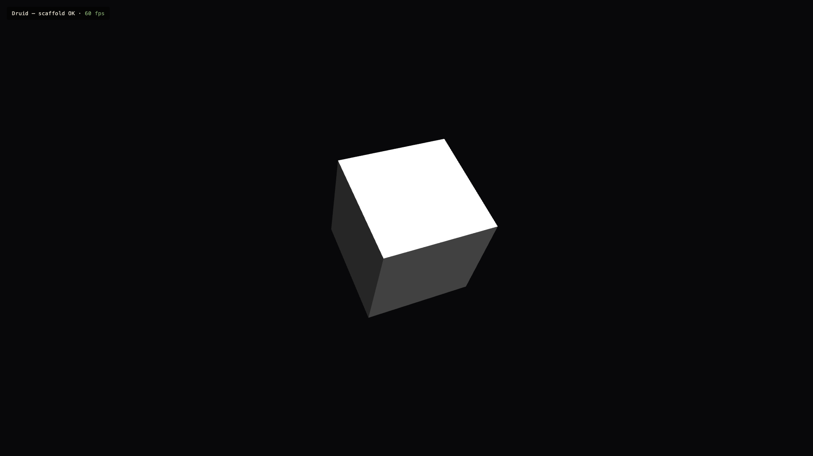

# 0.1 Project Scaffold

> 2026-09-27 · [plan](../../slopdocs/plans/0.1-project-scaffold.md) · commits `b18be46`, `0b533cb`

## What we built

The empty project: pnpm + Vite + strict TypeScript + Babylon.js, Biome, Vitest, the directory layout, and `AGENTS.md` with the architecture rules. To prove every piece works together, `pnpm dev` shows a smoke-test scene. It's a box driven by a miniplex ECS system and rendered by Babylon, with a Preact overlay reading an FPS signal.

## Key decisions

- **A lightweight ECS with [miniplex](https://github.com/hmans/miniplex).** It was chosen after a detour to explain what an ECS is and compare miniplex, koota and bitECS. Entities are plain typed objects, and systems are pure functions over queries.
- **The simulation is separate from rendering.** `ecs/` and `systems/` never import Babylon or Preact, so all game logic is unit-testable in Node. Babylon only mirrors ECS state. This rule shaped every step after it.
- **Preact + signals for screen UI, styled with CSS Modules + design tokens.** We rejected React (too heavy for an overlay), Tailwind and vanilla DOM. Signals let the game update the HUD at low frequency without per-frame re-renders.
- **Biome** instead of ESLint + Prettier: one tool, one config.
- **Logic-only tests, next to the code.** Rendering and feel get checked by playing.
- **`git init` now, with no hooks.** Cloudflare waits for step 0.5.
- **Every step gets its own plan.** We interview first and write `slopdocs/plans/<step>-<slug>.md` before any code. That became an `AGENTS.md` rule.

## Surprises & problems

- **`biome migrate` quietly turned linting off.** Biome 2.5 renamed `recommended` to `preset`, and the migration wrote `"preset": "none"`. We caught it and fixed it to `"recommended"`.
- **The bundle is 6.7 MB** (1.5 MB gzipped) because Babylon is imported from the package root. That's accepted for now and parked for the 9.6 performance pass.
- **The dev port became lore.** We asked for a thematic port and ended up with **5746 = "STAG"** (5=S, 7=T, 4=A, 6=G). It came from the stag form, the user's favourite WoW druid form. That also started `misc-thoughts.md`, with the idea of the stag as a lost "true" druid form in the endgame.

## Media

The screenshot above is the only thing there was to see: proof that Babylon, miniplex, Preact and CSS Modules all work together.
