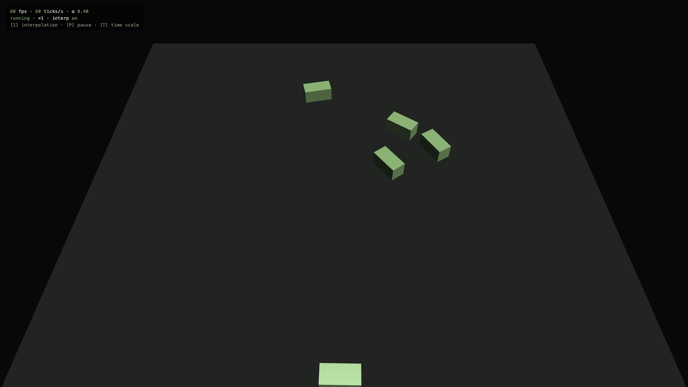
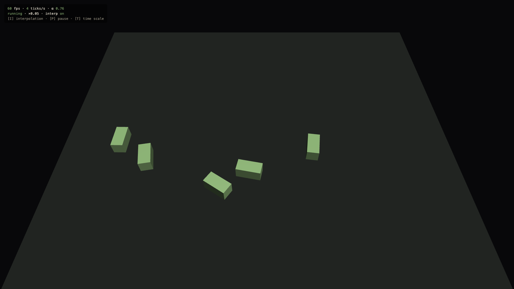
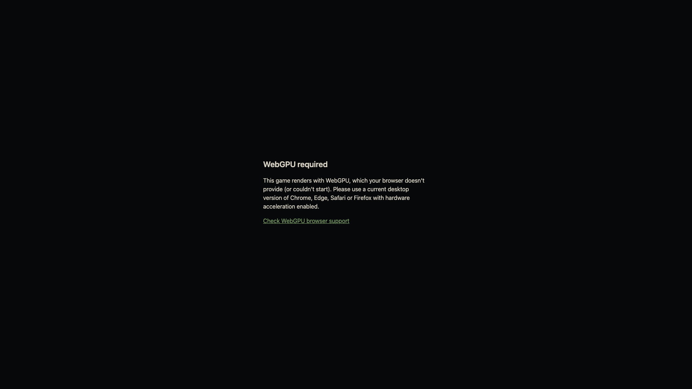

# 0.2 Game Shell

> 2026-09-27 · [plan](../../slopdocs/plans/0.2-game-shell.md) · commits `cf23b84`, `7992c8a`, `2303ca7`

## What we built

The real engine bootstrap and game loop: a **WebGPU-only** Babylon engine, a **fixed 60 Hz simulation** with rendering that blends between ticks, pause and slow motion, a seeded RNG, and a friendly "WebGPU required" screen for browsers that can't run it. The demo is a throwaway loop test scene: fast orbiting boxes and an overlay with FPS, ticks/s, the interpolation alpha and the time scale.

## Key decisions

- **WebGPU only, no WebGL fallback.** This was the user's call, against the recommendation of WebGL2. The goal is to be able to do "the coolest, most advanced things" and use the new stuff, at the cost of older browsers and OSes. Engine creation lives in one function, so a fallback would be a contained change if we ever need one.
- **60 Hz fixed tick + interpolation.** The question was whether gameplay could still look like 120 Hz. It can: rendering runs at the display rate and lerps between the previous and current tick. `TICK_HZ` is one constant, and systems only ever see `dt`.
- **Soft determinism.** Systems use only the `dt` they're given, take randomness only from a seeded `Rng`, and never read wall-clock time. There's no promise of bit-identical replays, but the door stays open.
- **Pause + time scale** (and auto-pause on blur) instead of a bare loop. Slow motion turned out to be very handy for checking interpolation.
- **Device pixel ratio capped at 2×.** Sharp on Retina without rendering 3× screens at full cost.
- **Automated checks run in headless Chrome only.** We tried headless Firefox, but it fell back to software rendering and its remote control never connected. Safari has no headless mode. Selenium wouldn't fix either, so both stay manual checks.

## Surprises & problems

- **Black flashes while resizing.** Dragging the window edge flickered game/black/game/black. Resizing a canvas clears it, and the resize ran in a `ResizeObserver`, which fires *after* the frame is drawn but *before* it's shown. The fix was to resize at the start of each rAF frame, right before rendering, so every resized canvas is drawn before it's painted.
- **Babylon's DPR handling ignores `limitDeviceRatio` on resize**, so we set the hardware scaling level ourselves every frame.
- **`engine.getFps()` returns `Infinity`** when the frame delta is 0, which happens under headless virtual time, so the overlay guards against it.
- Played by hand in Chrome and Firefox Developer Edition: **smooth at 120 fps** on a 120 Hz display, and auto-pause works.

## Media

