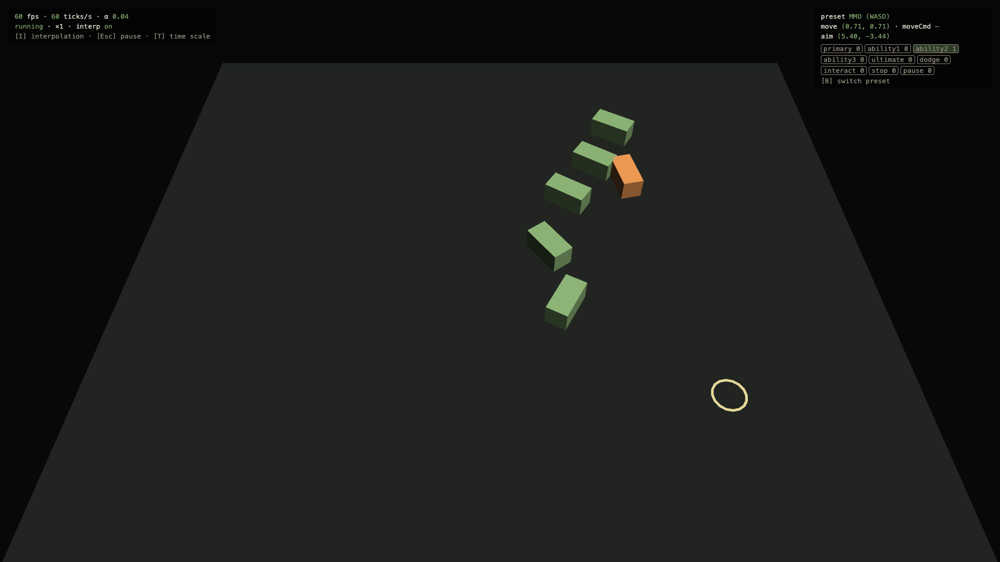
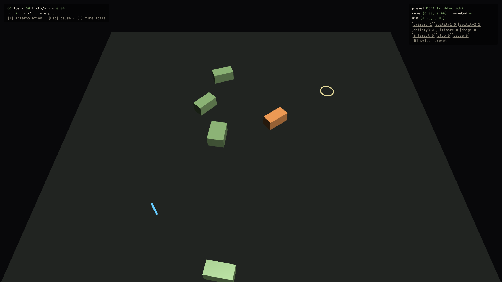

# 0.3 Input Layer

> 2026-09-27 · [plan](../../slopdocs/plans/0.3-input-layer.md) · commit `0e329e1`

## What we built

A real input layer. The DOM feeds key and mouse state into bindings (plain data). Once per simulation tick that becomes an `InputFrame` snapshot, with actions named by role (`primary`, `ability1`…), a camera-relative move vector, a right-click move command and a mouse-to-ground aim point. The demo adds an aim ring, a throwaway pawn, a move-to pin and an overlay that counts how many ticks saw each press.

## Key decisions

- **A per-tick snapshot into a pure sim.** Systems became `(world, dt, rng, input) => void`. A press reaches **exactly one tick**: it isn't lost when a frame runs zero ticks, and isn't doubled when a frame runs several. That keeps the sim testable and sets up input replay later.
- **Two control schemes, decided later.** The starting point was WASD movement, but the user wanted Q/W/E/R abilities, which clash on W. That led to League-style right-click-to-move. Instead of picking one now, we built **both presets**:
  - `mmo`: WASD, abilities on 1/2/3/4, RMB primary, LMB interact
  - `moba`: right-click move with hold-to-steer, Q/W/E/R, S to stop
  
  Step 1.7's feel gate decides which one stays, or keeps both as a setting. The design doc's "WoW-style, not click-to-move" line got softened to match.
- **Last pressed wins on opposite keys.** Holding A then tapping D goes right, and releasing D goes back to left. That's better for micro-adjustments than cancelling out.
- **Bindings use physical keys** (`KeyboardEvent.code`), so AZERTY players get the same layout. **Dodge (Space)** went in provisionally; universal vs form-specific is still open for 2.2.
- **Browser hygiene:**
  - no context menu on right-click
  - Space doesn't scroll
  - Cmd/Ctrl shortcuts still work
  - everything is released when the window loses focus, so no keys get stuck

## Surprises & problems

- **Right-click did nothing at first.** Babylon calls `preventDefault()` on `pointerdown`, which by spec suppresses the compatibility `mousedown`/`mouseup` events. We switched to pointer events and diff the `buttons` bitmask, which also catches a second button pressed mid-chord.
- **On macOS, keys pressed while Cmd is held never get a `keyup`.** Those presses are ignored, and pressing Cmd releases everything.
- **Babylon's `createPickingRay` already handles hardware scaling**, so the aim ring sits exactly under the cursor at 1× and 2×. We confirmed that by reading Babylon's source, not by trial and error.
- Several presses of the same action within one tick collapse into one. That's irrelevant at 60 Hz, but noticeable at ×0.05 slow motion. It's a known limit, and the latch can become a counter if abilities ever need it.

## Media

