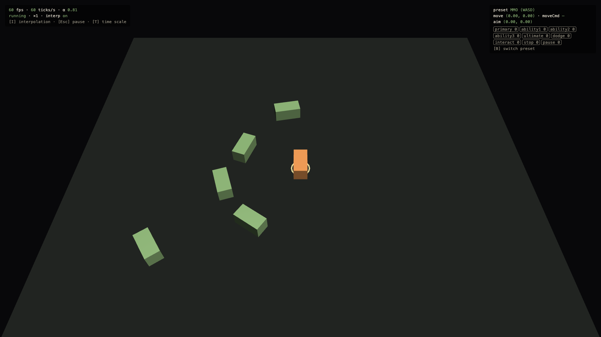

# 0.3.1 Devlog

> 2026-09-27 · [plan](../../slopdocs/plans/0.3.1-devlog.md)

## What we built

This devlog. Each step now ends with a short entry here: what we built, the decisions and why, and screenshots of the game at that point. The agent takes the screenshots with agent-browser. Videos are optional: record with QuickTime, drop the `.mov` in, and a pre-commit hook compresses it. Steps 0.1–0.3 (plus a 0.0 design prologue) were backfilled from the plans, the commits and the earlier Claude Code sessions.

## Key decisions

- **For looking back, not for players.** It sits in `devlog/` at the repo root (not in `slopdocs/`, and not in `public/`), so nothing ships with the game. Blog posts can be written from it later.
- **One entry per step, with a short fixed template.** It maps 1:1 to the implementation plan and stays skimmable.
- **Screenshots are the agent's job, ad hoc per step.** There's no scripted shot list to maintain. The number of shots scales with the step: a couple for systems work, lots for art and atmosphere.
- **Media goes straight into git with size limits** instead of LFS or R2. Screenshots are ~20–60 KB PNGs, and videos are compressed to ~10 MB or less.
- **Videos:** we looked for a clean in-browser way to record in Firefox, but there isn't one:
  - Firefox has no built-in recorder, and its extensions can't capture a single tab.
  - A canvas recorder would miss the HTML overlay.
  - Chrome's Element Capture works, but only in Chrome.
  
  So: **Firefox fullscreen + QuickTime**, plus a husky pre-commit hook that compresses any raw video it finds in `devlog/`.
- **Past sessions are sources, never artifacts.** Entries summarize the interviews and course corrections, with no transcript text.

## Surprises & problems

- **Headless WebGPU just worked.** agent-browser's bundled Chrome for Testing renders the game at 60 fps headless on macOS, with no flags.
- **agent-browser can't hold a key down**, so held keys are sent as synthetic `KeyboardEvent`s on `window`, which our input layer listens to anyway.
- **Compression works well.** A 128 MB 1440p/120 fps ProRes test clip came out as a 0.9 MB 1080p/60 fps MP4.

## Media

The screenshot above. The 0.3 input test scene was still the whole game.
