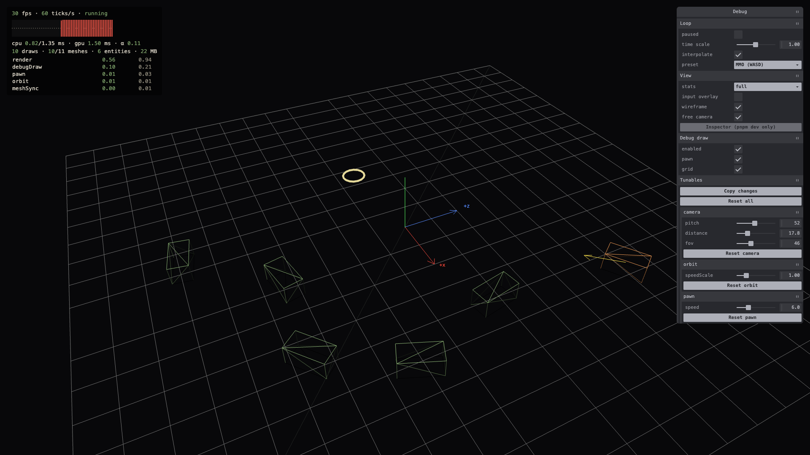
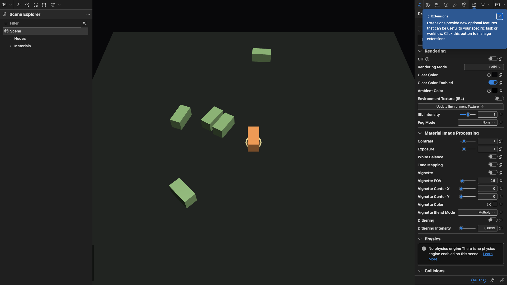
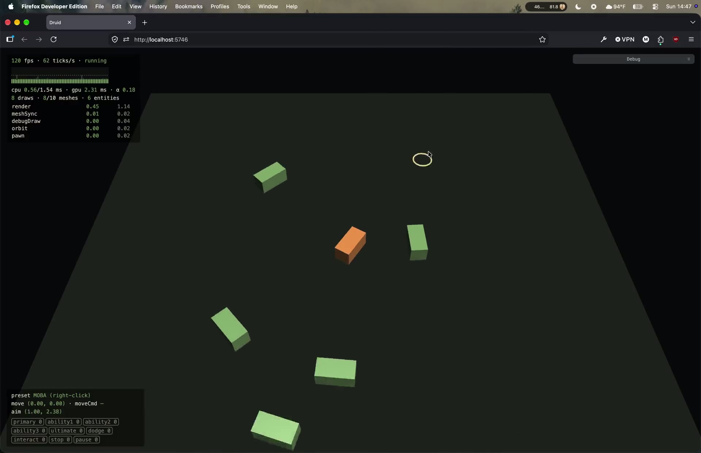

# 0.4 Dev Tooling

> 2026-09-27 · [plan](../../slopdocs/plans/0.4-dev-tooling.md)

## What we built

A toolbox that every later step will lean on. In debug builds a **debug pane** docks top right and controls everything: pause, time scale, stats, debug draw, the Babylon Inspector, wireframe, a free camera and the input overlay. <kbd>`</kbd> hides and shows it. Code declares **tunables** that show up as sliders; tweaks survive reloads, and "Copy changes" puts `pawn.speed: 6 → 7.5` on the clipboard to paste back into code. The stats overlay grew a frame-time graph and a **per-system profiler**, and any code (simulation systems included) can **draw debug shapes**. `window.__game` exposes all of it to the console and to agent-browser checks.

## Key decisions

- **Available in dev and with `?debug`.** The tools live in a lazy chunk that only loads in `pnpm dev` or with `?debug` on a production build, so we can poke at PR previews and playtest builds without players ever downloading them.
- **No dev keybinds; the pane controls everything.** Our first version had a dev-keys mode: <kbd>`</kbd> handed the keyboard to debug hotkeys (G draw, S stats…) plus a cheat sheet, and the game got no input while it was on. After trying it we dropped the mode: keys are always the live game bindings, and everything else is a click in the pane.
- **Tunables are a pure registry.** `defineTunables` lives in `core/`, so systems can declare their own numbers without breaking the no-DOM rule. The pane is generated from it. Code stays the source of truth: tweaks are stored locally and copied back by hand.
- **Debug draw is write-only and immediate.** Systems call `debugDraw.arrow(...)` during a tick, and the shape stays until the next tick, so it's still visible while paused. Timed shapes age with game time. When disabled, every call is a no-op.
- **Commands for everything else.** One `define` gives a pane button and `__game.run(id)`. Cheats in later steps will be one-liners.
- **We split the step in three.** Scenes, reset and the entity picker (0.4.1) and record & replay (0.4.2) come next.

## Surprises & problems

- **The Inspector bloated the player bundle** by ~380 KB gzipped even behind a dynamic import. It imports Babylon's root barrel, and so do we, so the bundler moved everything the barrel touches into chunks shared with the game. We made the Inspector dev-only; deep imports in the performance pass should bring it back to `?debug` builds.
- **GPU time was stuck at zero.** Babylon's frame-level GPU counter depends on `writeTimestamp`, which browsers dropped. The per-pass counter works once the device requests `timestamp-query`.
- **Every system took "0.00 ms".** Without cross-origin isolation, Chrome rounds `performance.now()` to 100 µs. COOP/COEP headers on the dev and preview servers fixed it.
- **The Preact preset aliases `react` to `preact/compat` by default**, which would have fed the React-based Inspector our compat layer. We turned it off.
- The free camera used to rely on dev mode swallowing input. Now it borrows just the mouse buttons from the game, so orbiting doesn't fire `interact` and you can still walk the pawn around with WASD while looking from the side. At first the aim still went through the game camera, so the aim ring drifted away from the cursor once you orbited. Aim now projects through whichever camera is rendering.
- The first grid drew on top of everything. It's now a normal depth-tested mesh, and only the ad-hoc shapes sit on top.

## Media

