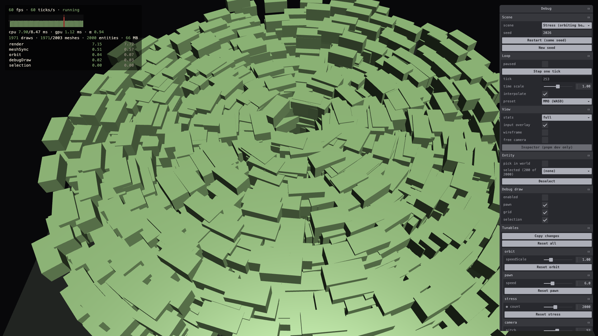

# 0.4.1 Scenes & Reset

> 2026-09-27 · [plan](../../slopdocs/plans/0.4.1-scenes-and-reset.md) · commit `5fc8a1a`

## What we built

The game can now restart itself in place. A scene is a small definition (the systems it runs plus a setup function), and the shell can load, reset or restart one without reloading the page: a fresh world, a reseeded RNG and tick 0. The engine, the pane and the Inspector stay put. The debug pane gained a **Scene** folder (switch scene, see and type the seed, restart with the same or a new seed), **frame step** with a tick counter, and an **entity picker**: hover outlines what's under the cursor, and clicking selects it and opens a panel with its components, live and editable. A second scene, a **stress test** of up to 5000 orbiting boxes, proves the switching and gives the later performance pass a benchmark.

## Key decisions

- **Scenes declare their own systems.** The global systems list went away, so the stress scene runs only `orbit` and the profiler shows exactly that. The arena (1.1) and the run (6.x) will just be more scenes, and death & restart (3.5) and room transitions (6.3) reuse the same reset.
- **Cleanup is tracked, not hand-written.** Setup registers listeners, render hooks and meshes through a context that undoes all of it on teardown. We checked for leaks by switching scenes 60 times: the mesh, material and observer counts came back to where they started.
- **Every load gets a brand-new world.** miniplex can't clear a world, and its entity ids never reset, so replacing the world was simpler than emptying it and keeps ids starting at 0 each run.
- **The URL is for debugging only.** `?scene=` and `?seed=` pin a startup scene and seed in debug builds, but the game never writes to the URL. Players shouldn't ever have to care about it. Reloads return to the last scene with a fresh seed.
- **Picking borrows the mouse**, like the free camera: while "pick in world" is on, clicks select entities instead of moving the pawn. A dropdown covers entities that are hard to click. The first version marked the selection with a debug-draw ring and listed its components inside the main pane. After trying it, we added a hover highlight, outlined meshes with Babylon's highlight layer, and moved the components into their own panel that only appears while something is selected.

## Surprises & problems

- **Babylon removes observers lazily**, so our first leak check showed the render-observer count climbing. Re-counting a moment later showed they were all gone.
- miniplex hands out entity ids on first request, not at spawn. The pane asks for them in world order, which keeps `#5 pawn` stable across restarts.
- **Mesh outlines didn't work on boxes.** Babylon's `renderOutline` pushes the mesh out along its face normals, so a box got a line on only a couple of edges. The highlight layer draws a proper silhouette. It then filled whole meshes solid whenever debug draw was on, because the debug-draw layer cleared the stencil buffer the highlight uses as a mask. It now clears only depth.
- The input overlay kept showing stale values in the stress scene. The input test now clears it when it tears down.
- A restart asked for mid-frame (the stress scene's count slider) now waits for the frame to end, so no frame runs half in the old world and half in the new one.

## Media

