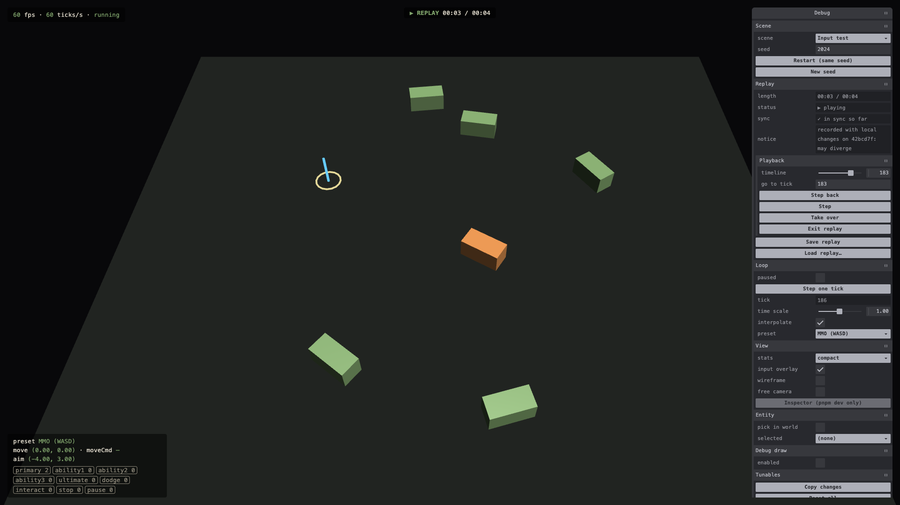
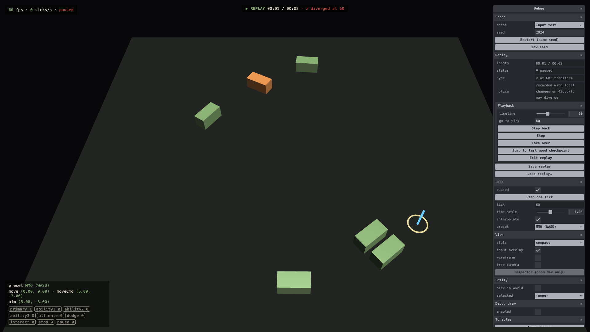

# 0.4.2 Record & Replay

> 2026-09-27 · [plan](../../slopdocs/plans/0.4.2-record-and-replay.md) · commit (pending)

## What we built

Every scene load is now recorded: the seed, the tunables at tick 0, the input of every tick and anything that changed the sim from outside (tunable tweaks, entity-pane edits, cheat commands). "Save replay" downloads it as a small gzipped file. Loading one plays it back tick for tick through the in-place reset. You can pause, step, change the speed, scrub the timeline (including backwards), or **take over** and play on live from any tick. Every second the replay compares a per-component fingerprint of the world, so it says "diverged at tick 60 in transform" instead of drifting quietly. Replays saved into `src/replay/fixtures/` run headless in Vitest as regression tests.

## Key decisions

- **The full version, after questioning it.** We doubted the payoff this early, with only two demo systems. What tipped it: reproducing the one-in-a-hundred bug is exactly what an action roguelite with enemies, AI and augments will need, and a determinism guard is cheapest to add while the sim is tiny.
- **Input sits on a 1/1024 grid.** Aim and movement are rounded before the sim sees them, so a replay feeds back exactly the same numbers, stored as small integers. The worst case is under 200 KB per 10 minutes gzipped.
- **Per-component checksums.** A mismatch names what went wrong (`transform`, `pawn`, `rng`), not just when.
- **Scenes split into a sim half and a view half.** `spawn(world, rng)` is Babylon-free, so the headless tests run the same scene code as the browser. The view only adds meshes and overlays.
- **A replay's tunables don't stick.** Playback swaps in the recorded values and gives yours back on exit, and nothing from a replay ends up in your saved settings.
- **Stale replays get rebased, not re-recorded.** After an intentional change, `pnpm replay:update` re-runs each fixture's input and rewrites only its checkpoints, like a snapshot update.

## Surprises & problems

- **Chrome and Node disagree on `Math.atan2`.** The first browser recording diverged in the headless test at tick 88, where the pawn's facing differed in the 16th digit. JavaScript only guarantees basic arithmetic and `sqrt` to be exact. Sine, cosine, atan2 and friends may differ per engine, and one wrong bit grows. We added a small deterministic math module (ports of the classic fdlibm routines) plus a test that fails if simulation code calls `Math.sin`, `Math.random` and the like. Browser recordings and Node runs now agree bit for bit.
- **The debug pane wrote values back unasked.** Tweakpane sometimes writes a field's current value back. For the entity pane, that recorded phantom edits. For the seed field, it restarted the scene, which silently ended a replay a moment after it began. Unchanged values are ignored now.
- An edit made while paused, after the last recorded tick, would have broken the final checkpoint. Checkpoints now also go right before every out-of-band change.
- Exiting a replay left the game paused, because the replay pauses at its end. Exit now resumes live play.

## Media

