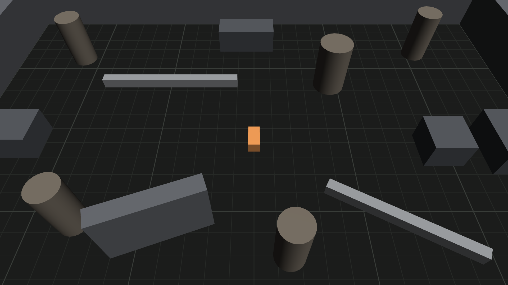
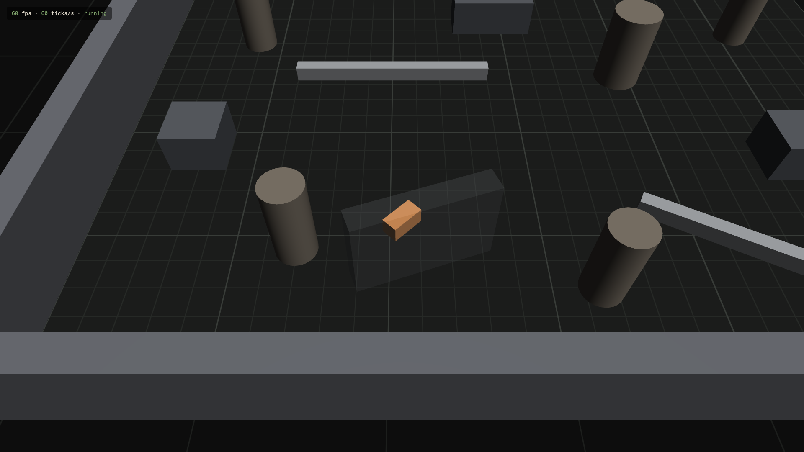

# 1.1 Grey-box Arena

> 2026-09-27 · [plan](../../slopdocs/plans/1.1-grey-box-arena.md) · PR #3

## What we built

The game has its first real place to stand in. The arena is a 30×20 m grey-box room with tall perimeter walls, pillars, blocks, low walls and a free-standing angled wall, on a floor with a 1 m grid. It's now the default scene, so production and every Preview start in it. The camera follows the demo pawn, and a new `camera.yaw` tunable joins pitch, distance and FOV. Any obstacle that hides the pawn fades out while it does. The pawn still walks through walls: collision is 1.3.

## Key decisions

- **Rooms are data, obstacles are entities.** The layout is plain TypeScript in `src/data/rooms/`. The arena's `spawn` turns each obstacle into a static ECS entity, and the view builds meshes from those entities. So 1.3 collision can read the same entities headlessly, and replays, snapshots and the entity picker already see the walls. We decided against view-only meshes, which 1.3 would have had to redo.
- **Circles and rotated boxes.** Two shapes keep collision simple 2D math. The yaw lets walls run diagonally, so rooms don't look like a spreadsheet. Each shape has a height, but only the view uses it (for now).
- **Obstacles fade instead of walls being built low.** The other option was the Hades trick of always keeping the near wall low. We went with fading any obstacle that covers the pawn to 25%, found by a few rays from the camera to the pawn. It works for pillars and blocks anywhere in the room, not just the perimeter.
- **Yaw 0 by default.** Walls line up with the screen and WASD maps cleanly (V Rising / League). The Hades-style 45° diamond is one slider away in the pane.
- **A hard follow for now.** The camera sits exactly over the pawn's interpolated position. Smoothing, look-ahead and bounds are 1.4's job. The camera is placed after mesh sync, so it doesn't lag a frame behind the pawn. Aim still uses the camera as it was last rendered, which is what the cursor was pointing at.
- **Our own WGSL grid.** Babylon's `GridMaterial` is GLSL-only, and on WebGPU that means downloading shader converters from a CDN at runtime. A 30-line WGSL shader draws antialiased 1 m and 5 m lines from the world position instead.

## Surprises & problems

- **Outside looked like inside.** Once the camera followed the pawn to an edge, the grid past the walls looked like more room. The shader now knows the room's size and draws the floor outside darker, with only faint 5 m lines.
- **Mesh sync would have boxed the walls.** It gives every entity with a `transform` the demo box. Obstacles never move, so they have no transform. Their footprint says where they are, and the scene links the meshes it builds itself (`ctx.bindMesh`) so picking still works.
- **4 m pillars towered.** With the perspective camera, pillars near the bottom of the screen leaned in and covered half the view, so they dropped to 3 m.

## Media

