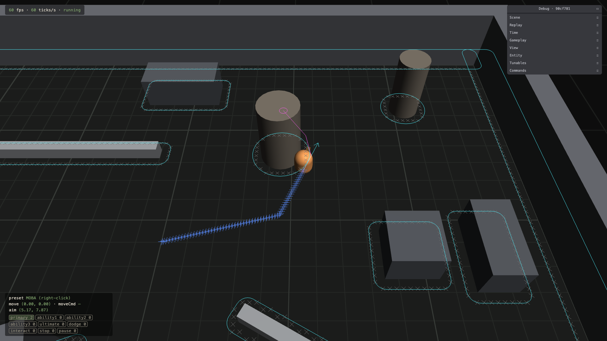
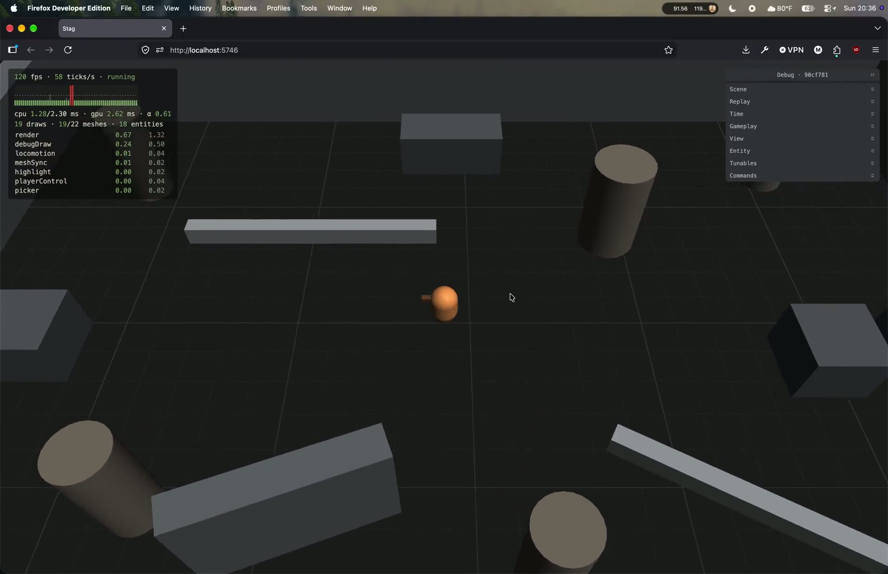
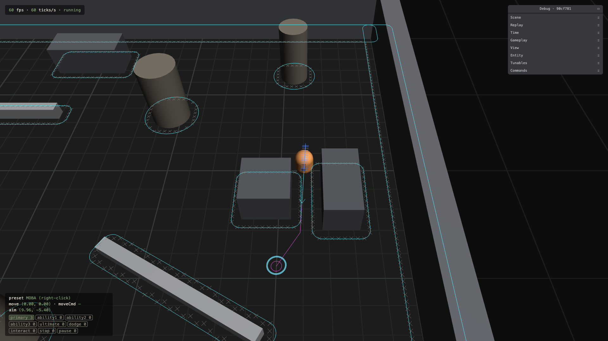
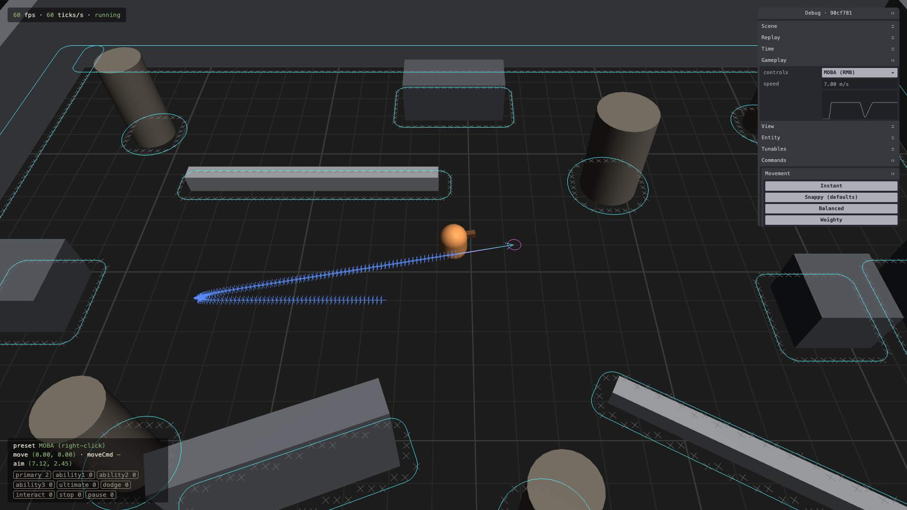
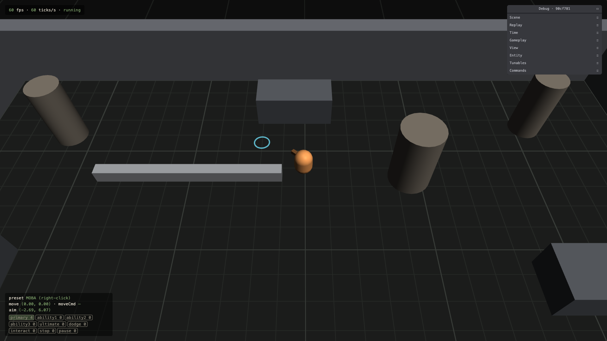

# 1.2 Player Movement

> 2026-09-27 · [plan](../../slopdocs/plans/1.2-player-movement.md)

## What we built

The throwaway demo pawn is gone, and the arena has a real player: a grey-box capsule with a nose that accelerates, brakes, steers and turns to face where it's going. WASD moves it directly. Right-click finds a path around pillars, blocks and walls, and the player brakes to land exactly on the click, where a ring pops on the ground. For tuning, there's a live speed graph, a motion trail, debug draw for velocity, paths and the nav grid, and five movement presets to switch the feel in one click. The input test scene went with the pawn.

## Key decisions

- **Linear acceleration, with velocity that steers.** Velocity moves toward the wanted velocity as a vector at a constant rate. So a reversal brakes through zero, a sharp turn arcs a little, and stops land on exactly zero instead of drifting. We picked it over an exponential ease, which feels floaty and never quite stops. Separate accel, decel and turn rates give each form its own handling later.
- **Balanced, found by playing.** The plan's defaults were Snappy: full speed in 0.06 s and a stop in 0.04 s. After playing, we added a preset between Snappy and Weighty, and it felt best, so **Balanced** (0.12 s up, 0.09 s down) became the default. Later we added **Steady** between Balanced and Weighty. The presets run from sharpest to heaviest: Instant, Snappy, Balanced, Steady, Weighty.
- **Facing follows movement, like League.** The character turns toward where it's moving at a fast rate and keeps its facing when it stops. Facing the cursor waits for abilities.
- **Pathing now, collision later.** Right-click-to-move can't be judged if it walks into every pillar, so pathing came in this step. WASD still walks through walls until 1.3. The obstacles are grown by the player's radius into circles and rounded boxes, rasterized into a 0.25 m grid, searched with A*, and pulled tight by line of sight, so paths run at any angle and hug corners. 1.3's collision will use the same grown shapes.
- **Brake to land.** Paths run at full speed through the corners and start braking at exactly the right distance on the last leg, so a click is a precise stop with no overshoot or snap.
- **Tunables now, form data later.** The numbers are a `player` tunables group that code reads only through `movementStats(entity)`. So per-form movement (10.1) and speed buffs or slows (4.1) have one place to plug in.

## Surprises & problems

- **The tight gap is roomier than we thought.** The plan said a 0.6 m radius would close the 1.25 m gap. But 1.2 m across still fits, so the test uses 0.65, and the radius tunable goes up to 0.8.
- **The capsule had to replace the placeholder.** Mesh sync gives every moving entity a box, and picking and the selection outline follow that box. Binding the capsule to the player now disposes the box and makes mesh sync move the capsule instead.
- **Presets shouldn't undo other tweaks.** Resetting the whole `player` group would also undo a speed or radius tweak, so presets only set acceleration and turning.
- **Chrome and Node agree on every path.** The new `arena-paths` replay was recorded in the browser: clicks around a pillar, into it and through the gap, hold-to-steer, a stop, a preset switch, then WASD. It replays in Node without diverging, including the A* tie-breaks.
- **Balanced cuts corners a little more.** At full speed its turn radius is about 0.8 m, so a path can graze a grown corner before the steering catches up. Collision in 1.3 will take care of that.

## Media

