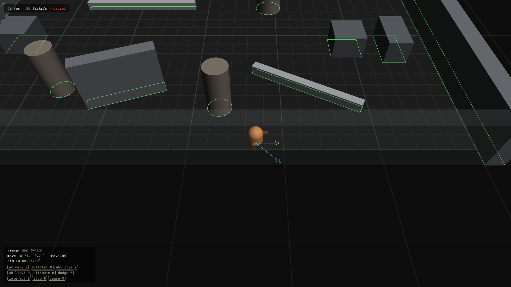
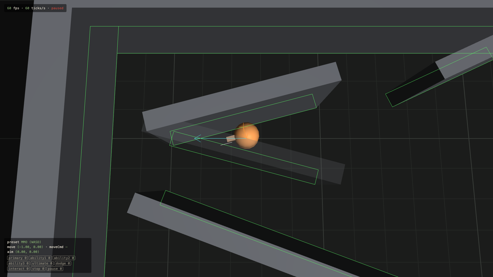
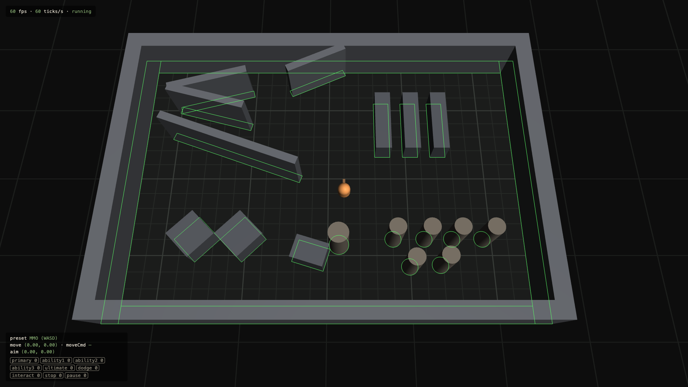
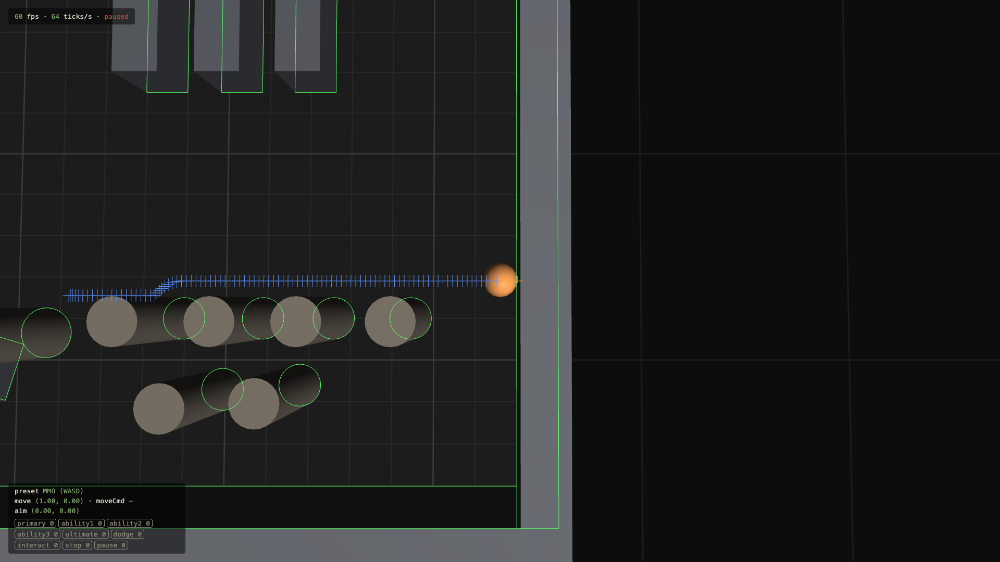
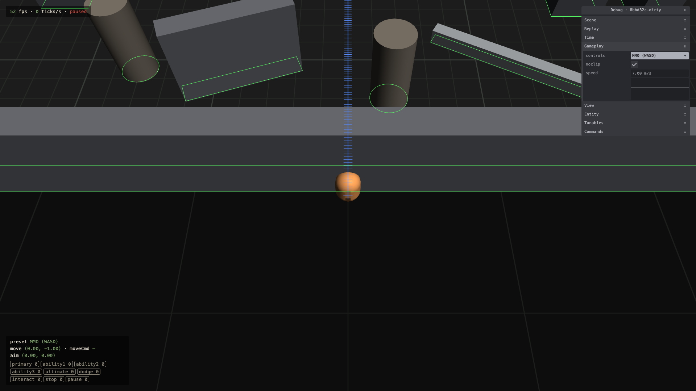

# 1.3 Collision

> 2026-09-27 · [plan](../../slopdocs/plans/1.3-collision.md)

## What we built

The player stopped walking through walls. Every tick, `locomotion` now sweeps the player's circle along its motion against the obstacles, grown by the player's radius (the same shapes pathing has used since 1.2). It stops just short of the first hit and slides the rest of the way along the surface. A second room, the **collision gym**, packs in the nasty cases: an acute wedge, a V against a wall, corridors 1 cm wider and 2 cm narrower than the player, a pillar cluster, and boxes touching at the corners. A **noclip** cheat walks through everything and replays like any other input.

## Key decisions

- **Projected sliding.** Pushing into a wall at an angle keeps only the part of the motion along it: 45° slides at ~71% speed, and head-on stops you. Hades and Diablo work this way. It's predictable and makes walls read as solid. Full-speed redirection felt too slippery on paper.
- **Swept, not move-then-push-out.** A cast can't tunnel through a wall at any speed, so the dashes, pounces and knockback of 2.x get that for free. The geometry stays small: the grown box is the union of two crossed rectangles and four corner circles, so a cast is a handful of exact ray tests. A final push-out stays as a safety net that should never fire.
- **Path corners are left to collision.** Click-to-move steering can cut a grown corner slightly. We didn't add a pathing margin, and it turned out not to matter (see below).
- **Cheats live in the simulation.** Noclip is the first `sim: true` command. It lives Babylon-free in `systems/cheats.ts`, so a headless replay in Node runs it just like the pane does in the browser.

## Surprises & problems

- **The random-walk test found a bug on its first run.** The broadphase kept only the obstacles near the straight-line motion, but a slide can turn sideways out of that box and into one it had skipped. The safety net used the same list, so it missed it too. A slide never makes the motion longer, so the fix was to keep everything within the motion's length of the start. After that, 3.2 million random ticks at up to 50 m/s never ended inside a wall.
- **Pillars broke the first wedge check.** It stopped any slide pointing into a surface hit earlier in the tick. Round a curved pillar, the earlier normals point "into" the slide once you're past them, so the player caught on pillars. Now it asks which other shapes the circle touches *right now*.
- **The speed dip at path corners wasn't collision.** The recorded fixture showed a drop to 3.8 m/s on one corner. Replaying the same input with collision off gave identical speeds: it's the 1.2 steering turning a sharp corner.

## Media

