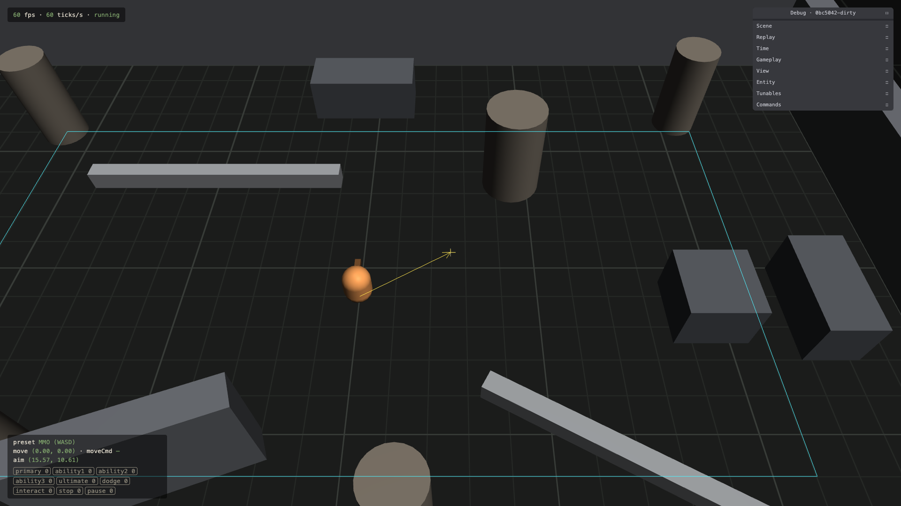
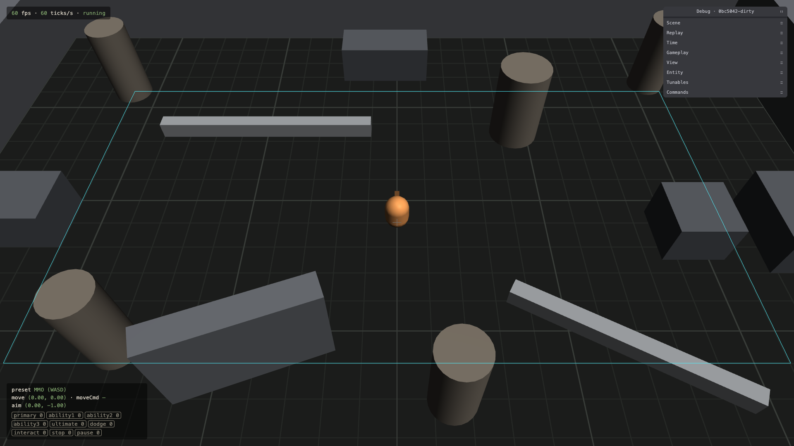
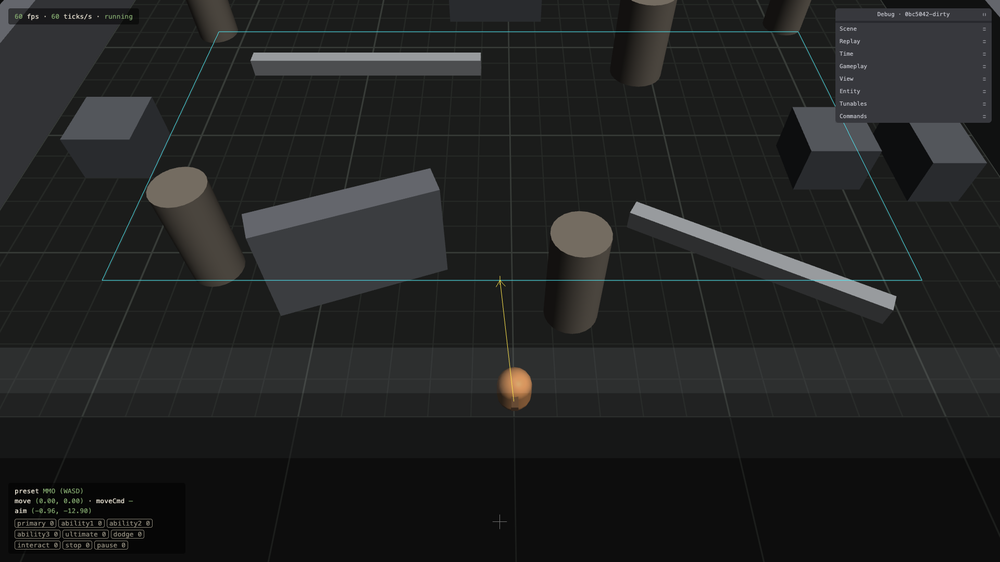
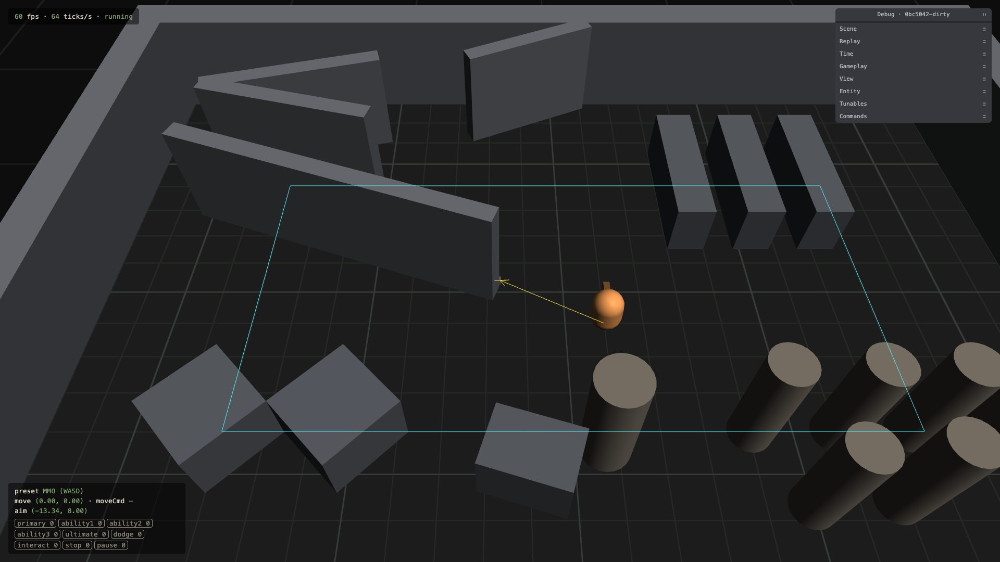

# 1.4 Camera Follow

> 2026-09-27 · [plan](../../slopdocs/plans/1.4-camera-follow.md)

## What we built

The camera stopped being a plain hard follow. It now leans toward the cursor by up to 3 m, so you see more of where you're aiming, and it eases that lean in and out over a quarter second. The player itself stays pinned: running, stopping and turning never lag. Near the room's edges the look-at point is clamped, so the lean can't swing the view out over the void past the walls. The simulation didn't change at all. Every replay fixture passed without being re-recorded.

## Key decisions

- **Look-ahead toward the cursor, not the movement direction.** Threats come from where you aim, and standing still to aim is when you most want to see further.
- **The screen position drives it, not the aim point.** The obvious version (lean toward the point on the ground under the cursor) chases its own tail: the camera moves toward the cursor, which moves the ground point under it further out. Measuring the cursor from the screen center instead has no feedback and feels the same at any pitch or FOV. A small dead zone keeps the view calm while the cursor is near the player, and it's remapped so the lean starts at zero at its edge, with no step.
- **Tight follow, smooth offset.** Only the look-ahead eases. A springy follow reads as cinematic, but it drifts the player off-center exactly when dodging, which is when you need to know where you are. A `follow` lag tunable (default 0) is there to try at the movement feel gate.
- **Bounds clamp the look-at point, inset from the walls.** Keeping the whole view inside the room would have nearly frozen the camera in the greybox, which is about one screen big. The clamp runs after smoothing, so it's hard.
- **View-only, pure and tested.** The rig math lives Babylon-free in `render/cameraRig.ts`, with unit tests for the dead zone, the axes at different yaws, frame-rate-independent easing and the clamp. The shell only feeds it the cursor, and it decides when the cursor doesn't count: outside the canvas, page unfocused, replay playback, free camera. While paused, the view holds still.

## Surprises & problems

- **The first browser run swung the view straight to the bounds.** The shell passed the whole `camera` tunables object as the look-ahead options. It has a `distance` too: the camera's 17.8 m distance from the player. The unit tests couldn't catch it, but reading the look-at point in the browser did. We now build the options explicitly.
- **A single inset isn't symmetric on screen.** The camera looks north, so at the south wall the near half of the screen still shows about 8 m of floor past it, while the north wall barely shows any. Fog in 1.5 should hide most of it, and per-side insets are an option at the 1.7 feel gate.

## Media

