# 1.5 Early Atmosphere

> 2026-09-28 · [plan](../../slopdocs/plans/1.5-early-atmosphere.md)

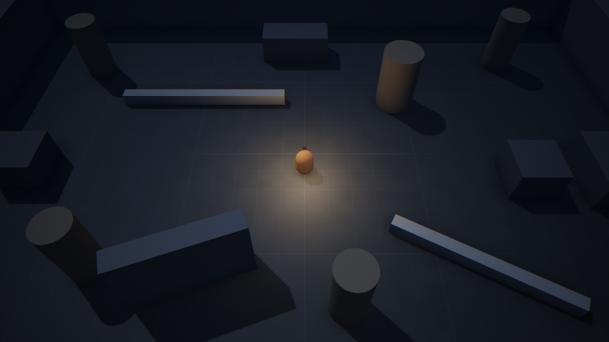

## What we built

The grey-box stopped looking like a debug view. One atmosphere rig, built by the shell and shared by every scene, lights the room with a cold blue moon that casts soft shadows, a dim cool fill, and a warm, slowly breathing light that hangs over the druid. Distance fog plus a height fog that pools along the floor cover the void past the walls, and a post stack (HDR, ACES, bloom, vignette, curves grading, MSAA, grain, chromatic aberration, SSAO) finishes the image. Everything is a tunable, colors included, and three new View toggles help judge readability: the atmosphere off (flat grey-box lighting), a greyscale value view, and stand-in threats. The simulation didn't change: every replay fixture passed untouched.

## Key decisions

- **Cold moonlight, warm druid.** The cold/warm contrast makes the player the easiest thing to find, and leaves warm reds free for danger later. We rejected a torchlit dungeon (hard to read, many lights to budget) and a green corruption tint (fights with telegraph colors).
- **Only the moon casts shadows.** One directional shadow map, its frustum fit to the shadow casters' bounds by a small tested function that mirrors Babylon's light view. A shadow-casting player light (six renders a frame) can wait for the art pass.
- **Height fog as a WGSL material plugin, not a post-process.** It rides on Babylon's own fog switch, costs a few instructions per pixel, and its closed-form integral is mirrored in TypeScript and checked against a brute-force integration.
- **PBR for the grey-box.** Pack assets will be PBR, so lighting tuned now carries over. The unlit grid floor became a lit PBR floor with a faint grid and some noise added by a second plugin, so distances still read while tuning movement.
- **Markers and debug lines skip the look.** They moved to an overlay scene drawn after post-processing, so the click marker and debug draw keep their true colors and never bloom or pick up grain.
- **Readability tools, not just a checklist.** The value view and stand-in telegraphs turned "is it readable?" into something we could look at. They already show the dark stand-in enemy separating from the floor only by its eyes.

## Surprises & problems

- **`from` is a reserved word in WGSL.** The first height-fog shader failed to compile.
- **The post stack was silently detached.** Re-attaching after an SSAO change passed Babylon's live camera array to a detach call, which emptied it. Image processing fell back to the materials, so the image still looked roughly right. Counting the camera's post-processes in the browser caught it.
- **ACES halved the brightness.** The lights were balanced without tonemapping, so exposure went to 2.2 and the lights were retuned by measuring mean brightness in the screenshots.
- **Banding rings came from SSAO.** Its copy of the scene color is 8-bit by default, which bands in dark linear values. A half-float copy fixed it.
- **The player light blew out the player's own head.** It hangs 1.3 m above the top of the capsule, and light falls off with the square of distance, so the head got several times the floor's light and bloomed to white. Playtesting on the Preview caught it. The light now skips the player's body, so it only lights the world around the player.
- **Then the floor felt dull.** Without the white head blooming in the middle of it, the pool of light looked flat and the breathing was invisible. The floor was the least reflective surface in the room. A lighter floor brightened the whole room under the moon, and a glowing wisp at the light floated detached above the head. What worked was a slight sheen (roughness 0.92 to 0.7), twice the light, and ±12% breathing. The shots after the hero shot were taken before these two fixes.
- **Headless Chrome was no guide to performance.** It was capped at 30 fps, and the same settings measured 1 to 19 ms of GPU time. In Firefox on a real machine, the full stack runs at 120 fps with about 6 ms of GPU time.

## Media

[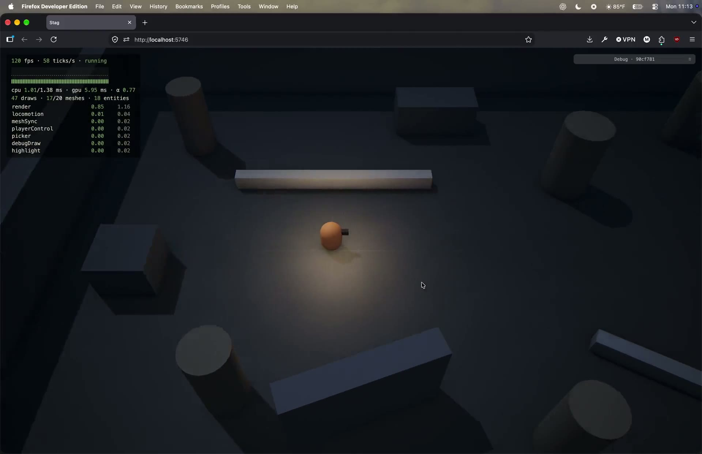](arena-atmosphere.mp4)

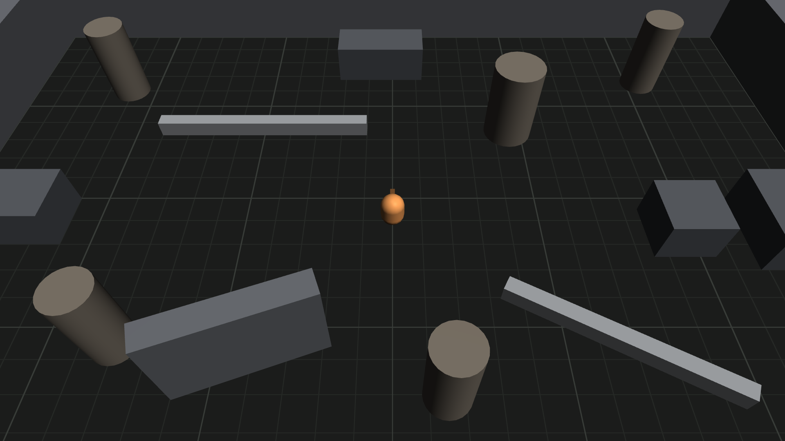

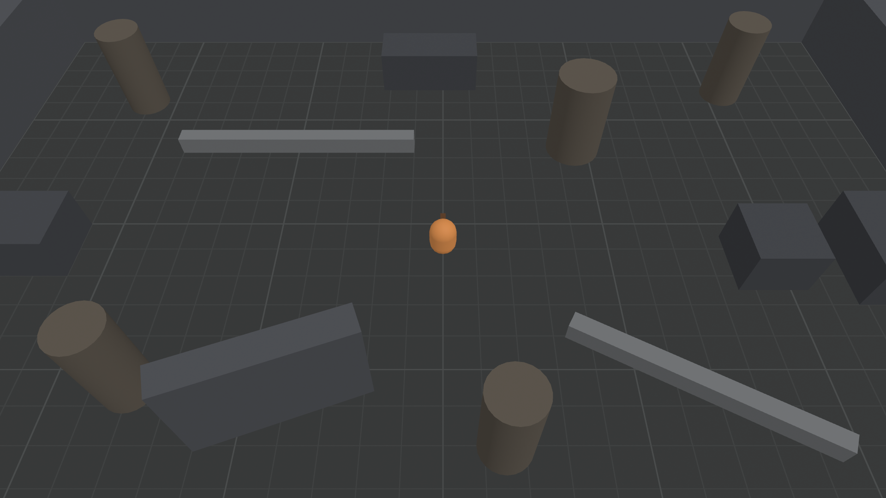

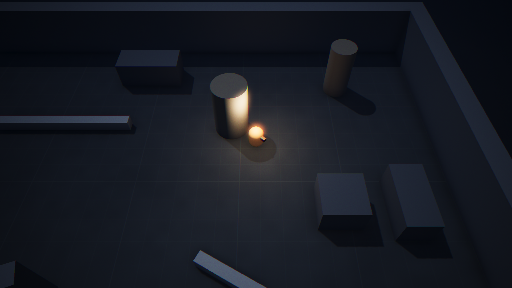

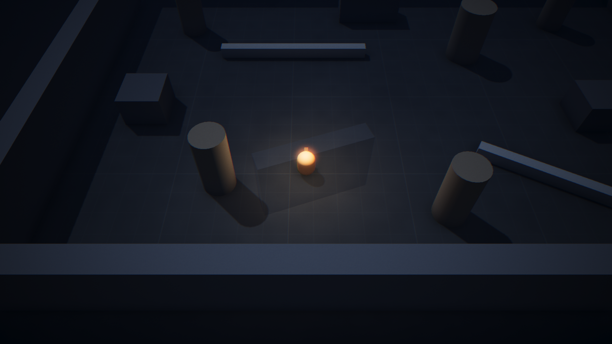

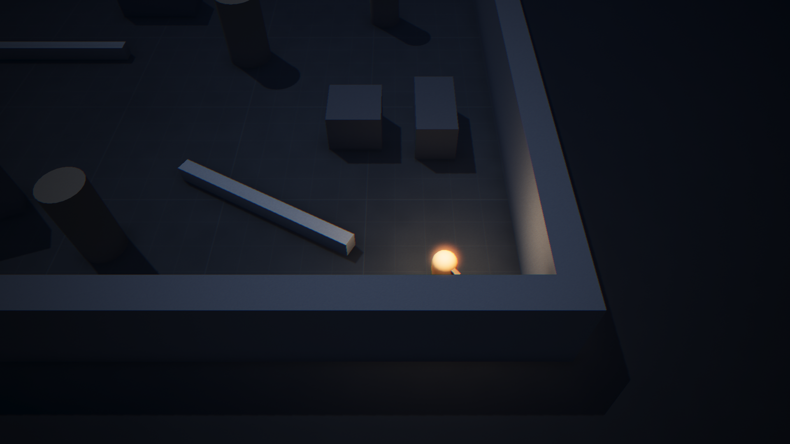

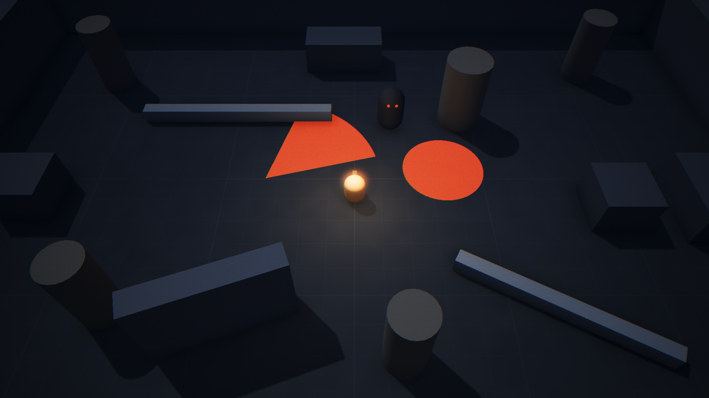

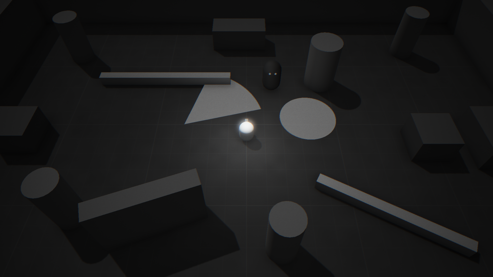

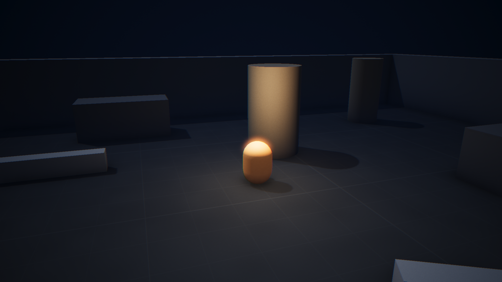

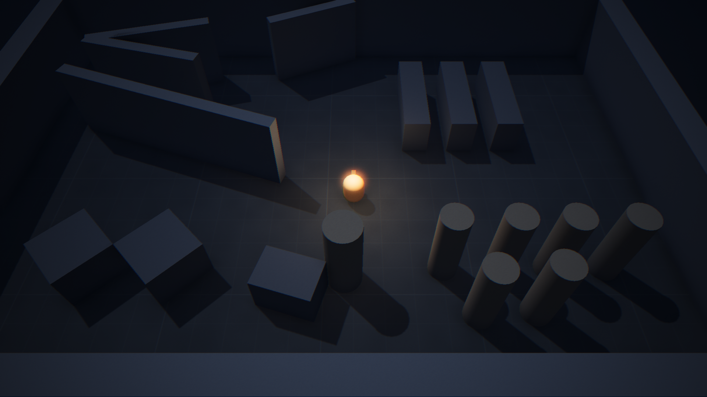
