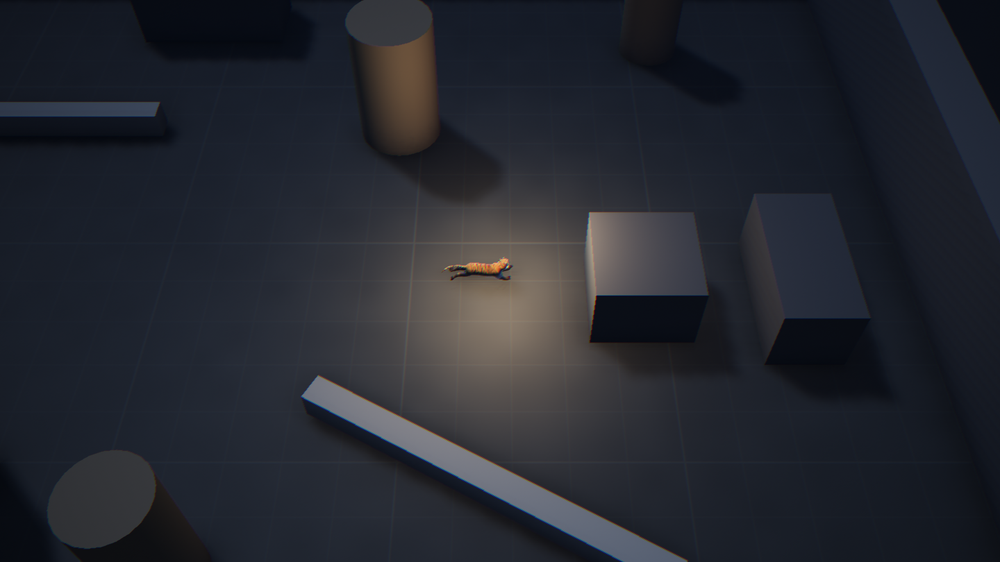
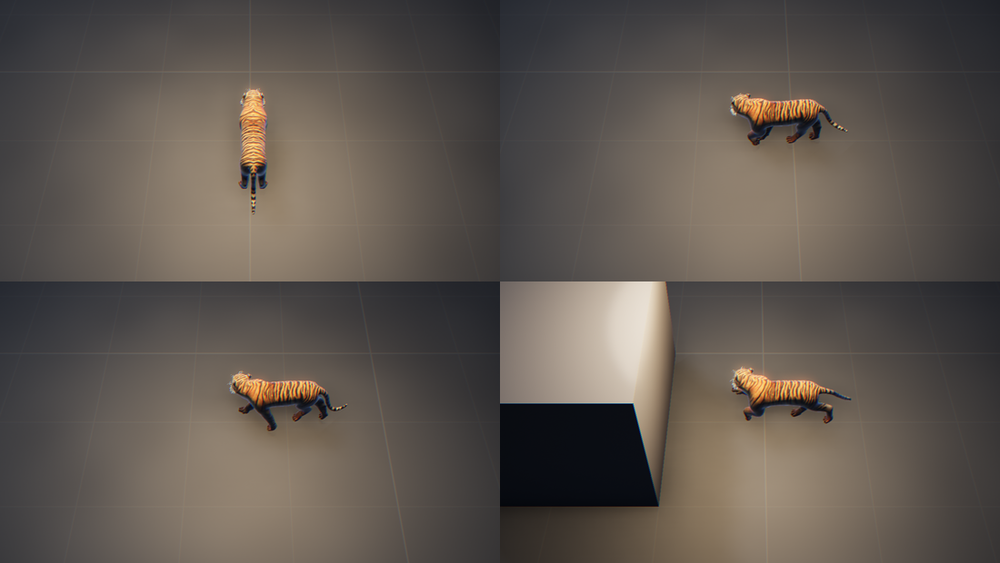
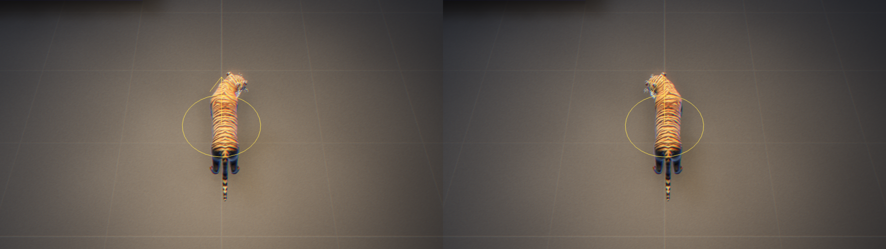
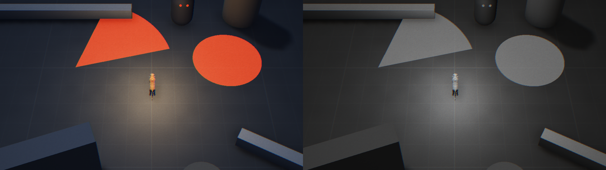
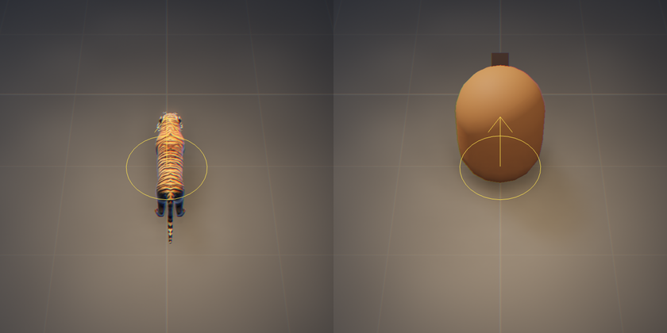
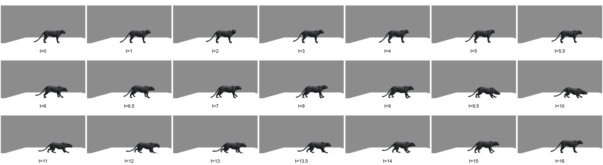
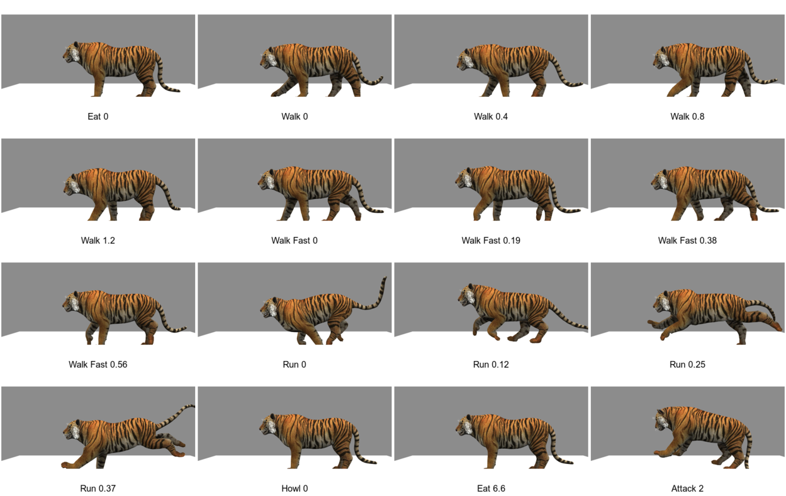

# 1.6 Placeholder Character

> 2026-09-28 · [plan](../../slopdocs/plans/1.6-placeholder-character.md)

## What we built

The grey-box capsule became a tiger, standing in for the Cat form until the art pass. It stands and breathes when still, then walks, trots and gallops as the player speeds up. Four clips are blended by speed on one shared stride, so the footfalls line up. On top of the clips, procedural layers bank the body into turns, tilt it when speeding up and braking, swing the tail and turn the head toward the cursor. It's all view-only and runs on the time the view shows, so pause, frame step, time scale and replays show the same motion, and every replay fixture passed untouched. A small build script turns the downloaded model into a 1.8 MB game-ready file, the shell preloads it once, and a "placeholder body" switch in the pane brings the capsule back next to the new `footprint` debug circle.

## Key decisions

- **No low-poly, even for a placeholder.** We started from CC0 low-poly packs and dropped them: they aren't the direction of the game. Mid- and high-poly CC-BY models from Sketchfab were the fastest source we could commit.
- **Check the animations before committing to a model.** We picked a black panther for its looks. Reading its one 16.5 s clip frame by frame, and tracking each foot through the skeleton, showed each foot stepping only once or twice: an idle, a few shuffling steps, a crouch and a step back. There was no gait to loop, so we switched to a tiger with real walk, trot and gallop cycles.
- **Sample the clips ourselves.** Babylon's animation groups advance on wall-clock time. Evaluating the clips by hand on `viewTime()` (the sim time the view shows, new on the scene context) freezes on pause, steps with a frame step and follows replay seeks, and made a shared stride phase across gaits easy.
- **Built offline, committed as output.** `pnpm models:build` renames the clips, adds a held idle pose, drops a zero specular that made the fur look dead, converts the textures to WebP and quantizes the geometry: 12 MB became 1.8 MB. The original stays out of the repo and is credited in CREDITS.md.
- **Scale to the footprint, leave the sim alone.** The tiger is drawn at half size, with its torso centered on the 0.4 m collision circle. A capsule footprint or per-form sizes can come with 10.1.

## Surprises & problems

- **Every bone name had a suffix** (`Bip01 Spine1_03_11`), so the first build threw on the first frame and the render loop stopped silently on a black screen. Rendering one frame by hand from the console surfaced the error.
- **The tiger was too dark, then too bright.** The capsule had been kept out of the player's warm light (it blew out its head). The tiger is low enough to take it, but its back then faced the light head-on. Lighting it and halving the direct light on its fur (`tiger.light`) keeps it orange with readable stripes.
- **The model's origin is at the hips**, so the head pushed into walls until the model was shifted back.
- **A readability note for later:** the tiger's orange sits close to the red-orange of the stand-in danger telegraphs. That's something to settle in 3.2 and with the real Cat model.
- **The glTF loader split the bundle** into many small lazy chunks. The first load grew by about 0.1 MB gzipped, plus the model.

## Media

The four gaits up close: idle, walk, trot and gallop.

The head follows the cursor, here to the right and then to the left.

With the stand-in threats, in color and in the value view: the tiger stays the brightest, warmest thing in the room.

The `footprint` debug circle under the tiger and under the capsule, which the "placeholder body" switch brings back.

Why the panther didn't make it: one clip, and frame by frame it's an idle, a few shuffling steps, a crouch and a step back.

The tiger's clips from the side, as we checked them before building on it: the idle pose, walk, trot, gallop and the unused howl, eat and attack.

