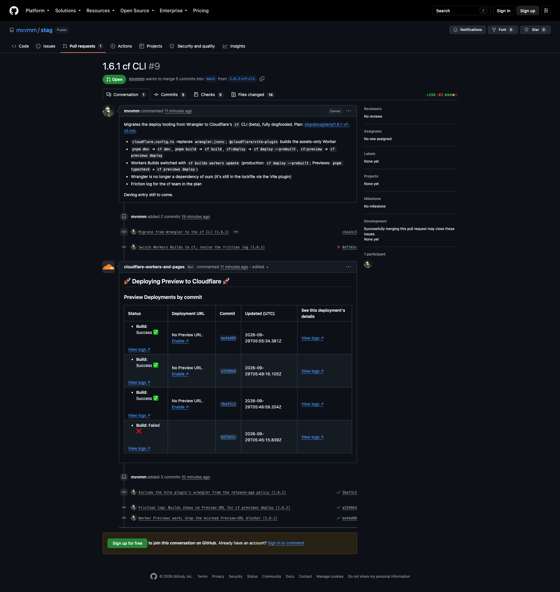

# 1.6.1 cf CLI

> 2026-09-29 · [plan](../../slopdocs/plans/1.6.1-cf-cli.md) · [PR #9](https://github.com/mvvmm/stag/pull/9)

## What we built

A small detour between movement steps. Cloudflare had just launched `cf`, its new CLI (an open beta, `1.0.0-beta.5`). Wrangler will point to it once the beta ends, and we moved over while our setup was still tiny: one static-assets Worker with no code and no bindings.

- `cloudflare.config.ts` replaces `wrangler.jsonc`, and the Cloudflare Vite plugin builds the assets-only Worker.
- `pnpm dev` is `cf dev`, and `pnpm build` is `cf build`. Deploys use `cf deploy` and `cf previews deploy`.
- Workers Builds runs cf for production and Worker Previews. We switched it with `cf builds workers update`, not the dashboard.
- Wrangler is no longer one of our dependencies.

The game didn't change: the built bundle is byte-identical to the one Wrangler used to ship.

## Key decisions

- **Dogfood all the way.** The user works at Cloudflare, so the rule was cf for every Cloudflare operation and no quiet Wrangler fallbacks. Anything cf couldn't do yet went into a friction log in the plan, for the cf team.
- **The Vite plugin path.** `cf migrate` offered to keep Wrangler as the bundler, which leaves a `wrangler.config.ts` behind. We took the Vite route instead: one cf config, with Vite owning the build.
- **`pnpm dev` goes through `cf dev`.** It adds a thin layer in front of Vite, but everything starts through cf, as the dogfooding rule asks.
- **Pin the beta exactly, bump it every step.** Builds and local run the same version, and we stay current.

## Surprises & problems

- **cf's docs weren't live yet.** The `developers.cloudflare.com/cf/` pages returned 404, so we worked from `--help`, `cf cli search` and a dry run of `cf migrate` on a throwaway clone.
- **Wrangler never fully leaves.** `@cloudflare/vite-plugin` depends on it, so it stays in the lockfile. It also nearly sank the first push: pnpm 12's release-age policy rejected the day-old `wrangler@4.143.0` in CI, and every job failed until we added an exclusion.
- **Vitest and the plugin can't share a config.** Both tried to own the Vite server, so the plugin now sits out when `VITEST` is set.
- **`cf build` can't make a Preview build.** Only `cf previews deploy` marks its build as a Preview, so Builds' Preview step only typechecks and lets `cf previews deploy` build.
- **No local serve of a cf build.** `pnpm preview` falls back to a plain `vite build` + `vite preview`, still in workerd, with the real headers.
- **We misread the PR comment.** Cloudflare's PR comment shows "No Preview URL" in its per-commit column. We first logged that as a blocker. The user pointed out that the column is about per-version URLs. The Worker Preview itself was deploying fine at its stable branch URL all along.
- **Nice surprises.** cf loads `.env` by itself, `cf previews deploy` prints clean JSON with the URLs, and your OAuth login covered what the per-Worker token couldn't (Builds settings).

## Media

