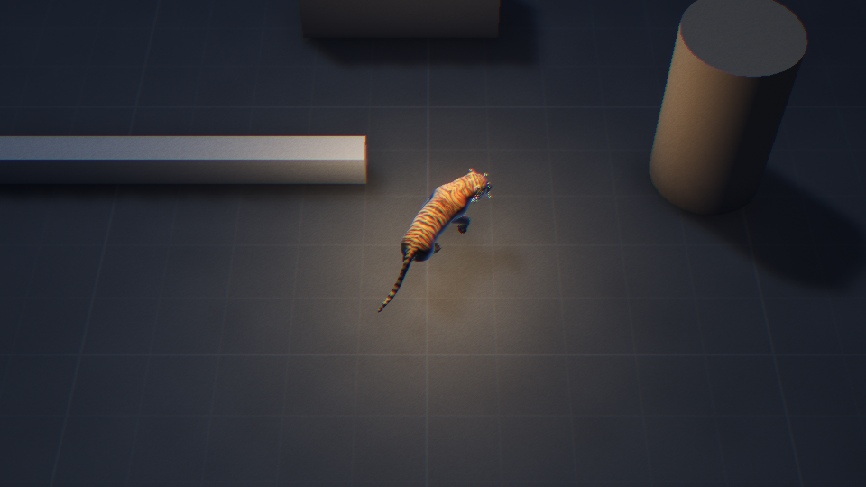
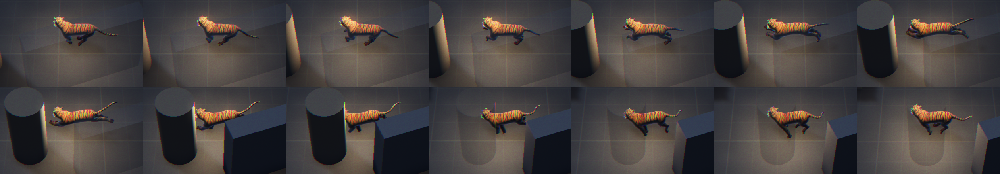
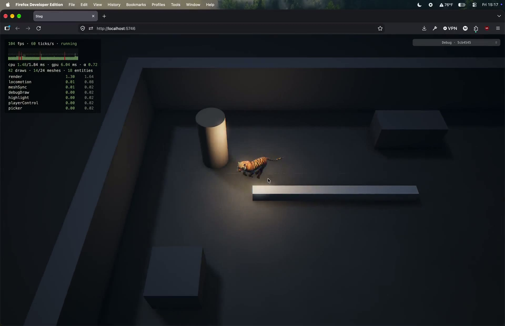
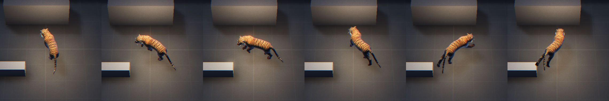
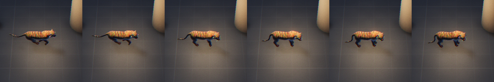
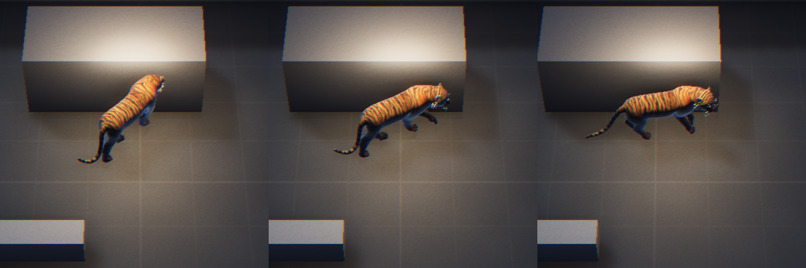
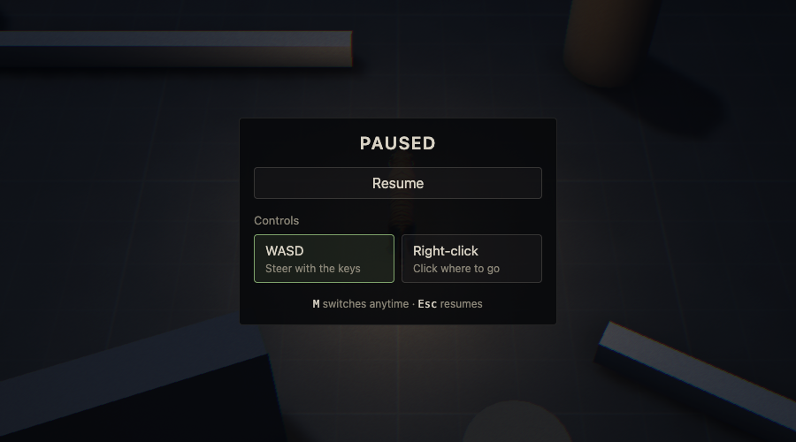

# 1.7 Movement Feel Pass

> 2026-10-02 · [plan](../../slopdocs/plans/1.7-movement-feel.md)

## What we built

This step was meant to tune movement until running around an empty room was fun, and to pick a control scheme. In the interview it turned out the mechanics already felt right: speed, acceleration and League-fast turning. The stiffness was all in the tiger. It spun like a rigid two-meter pole, slid in and out of its gaits with no start or stop motion, and showed a muddy mix of trot and gallop at its 4 m/s cruise. So most of 1.7 went into the view. The sim keeps its instant facing, and the body now bends through turns, pushes off on starts, finishes its step and rocks forward when it stops, shuffles for tiny moves and gallops cleanly at cruise. One real sim bug got fixed along the way, and both control schemes stay as a player setting, picked from a new pause menu.

## Key decisions

- **Both schemes, WASD by default.** WASD and right-click both stay, so every ability and enemy from here on has to work with both. Esc opens a small pause menu with the choice, and M still switches anytime. It turned out the code's default had been right-click all along.
- **Keep the sim honest, fix the look.** League's cats turn just as fast as ours. They look fluid because the body has slack, not because the turn is slower. So the root keeps the sim's exact facing. Two springs pull the shoulders and then the hips round after it, and the spine between them bends. We kept the size: the tiger is the right scale, just longer than Nidalee's cougar. That's a note for our own Cat model (9.3), not something to fake now.
- **Reversals swing back the way they came.** Spamming A and D made the tiger spin in full circles: at exactly 180° the shortest-arc rule always broke the tie the same way. Now each mover remembers which way it last turned, and a reversal undoes that turn. Moving north, A/D flips back and forth through north forever. It's one plain number on the mover, so replays and snapshots stay exact.
- **Stop where the legs are already almost standing.** Rather than tracking feet through the skeleton, we sample each gait clip 48 times per stride when the model loads and score how far each pose is from the idle's. On a stop, the gait strides on, for at most a quarter second, to the lowest point ahead, then fades into the idle. It's simple, works on any rig, and keeps the legs from sliding together mid-stride.
- **Short moves shuffle.** A right-click under a meter, or a key tapped for less than 0.12 s, plays walk steps instead of a burst of gallop. Longer moves commit and cross-fade into the gait.
- **One gait at cruise.** The gallop now fully takes over from the trot by 3 m/s, so 4 m/s is the run clip alone at 0.8×, not two rhythms blended.

## Surprises & problems

- **The default scheme was moba.** A fresh browser started with right-click because `DEFAULT_PRESET` said so, which nobody had noticed with M around.
- **Synthetic key presses did nothing** at first while checking in headless Chrome: the profile was on right-click, where W isn't bound.
- **The shoulders still lag a little.** In frame steps they're about 60° behind the sim two ticks into a 90° turn. That's a tuning call for the playtest (`anim.bendFrequency`), not a bug.
- Every replay fixture got new checkpoints: the mover has a new field and some reversals now turn the other way. The behaviour checks from 1.6 all still pass, plus a new A/D-spam check.

## After the first playtest

The pass helped, but the gallop still looked off: the legs moved more than the body did, it didn't run like a cat (Nidalee's run is a string of pounces), and the rump stayed perfectly still while everything around it moved. We ran forward kinematics on the clip's bones in Node to find out why. The run's planted feet slide back at about 7 m/s, not the 5 we'd judged by eye, so at our 4 m/s the legs cycled 40% too fast. Its feet land one by one, a rotary gallop. And its hips are simply pinned: the pelvis has no animation at all.

So the tiger now measures its own run when it loads. It finds when each foot is planted and shifts each left/right leg pair toward each other in time, so the hind pair and then the front pair land nearly together (`anim.bound`). It also works out, from where the feet are, how the body should move over a stride: up in flight and down on the landings, nose up on the hind push and down on the front landing, and the back curling as the hind feet come under it. The whole body now moves with the stride, rump included. A second note asked for the torso to bunch up and spread out with each pounce, so the back now arches into a slight upside-down V as the legs gather and flattens as they spread. Our first try at that bent the wrong way, which we only caught by measuring the spine's height in the browser: the camera looks down too steeply to see a back's curve.

**A stop we threw away.** We tried stopping leg by leg: planted feet held, the others landing and then stepping into the stance one at a time. It was technically right and looked uncanny, so we reverted it. The stop is back to the simpler blend for now, and we'll come back to it.

**A living tail.** The tail now never sits still. Standing, it wanders slowly side to side, lifts and lowers, curls its tip, and now and then swings out further. Running, it swings in time with the stride, wanders on top of that and rides higher. The randomness is smooth noise of the view's time rather than `Math.random`, so pausing, frame stepping and replays still show exactly the same tail. The first amounts looked fine on paper and barely moved the tip, which we only noticed by measuring it.

## Media

A playtest in Firefox after the follow-ups: the pouncy gallop, the living tail, and right-click paths around the greybox.

A/D spam after moving north: every flip swings through north, body curved, never round through south.

A stop: the gallop strides on into a standing pose and the head dips forward as the body settles.

A start from standing: the push-off drops the nose and dips the hips into the first stride.

The pause menu, a placeholder for 6.1.

