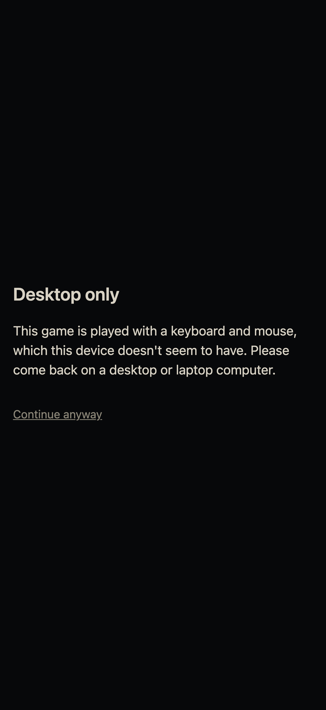
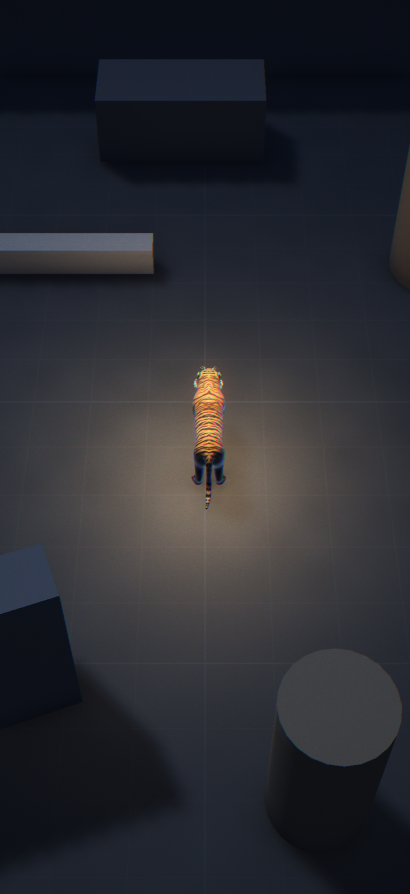
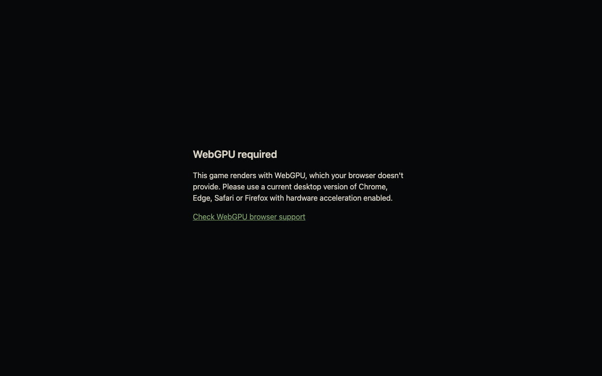
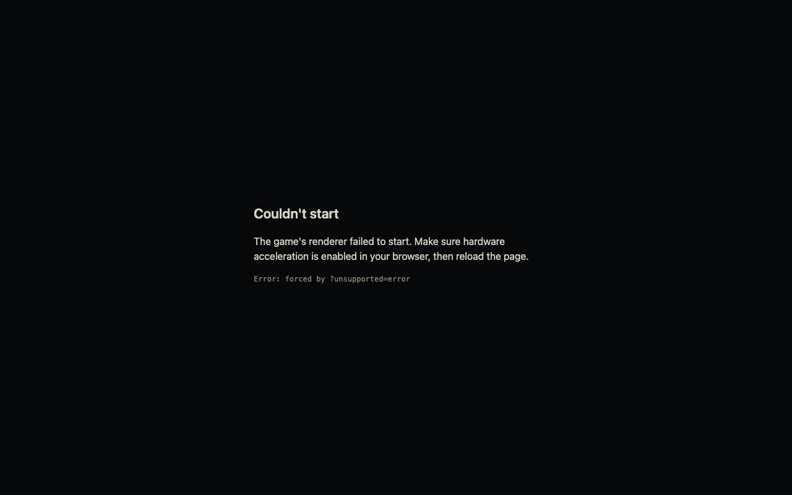

# 1.7.1 Unsupported Devices

> 2026-10-02 · [plan](../../slopdocs/plans/1.7.1-unsupported-devices.md)

## What we built
A quick fix for phones. The only gate so far was WebGPU, but current phones have it (iOS 26 Safari, Android Chrome), so they loaded a game that needs a keyboard and mouse and then just sat there. Now a device without a mouse or trackpad gets a "Desktop only" screen with a quiet "Continue anyway". The Unsupported screen from 0.2 became one screen with a text per reason: no mouse, no WebGPU, or a renderer that failed to start.

## Key decisions
- **Ask about the pointer, not the device.** The check is `matchMedia("(any-pointer: fine)")`: is there *any* precise pointer? That blocks phones and touch-only tablets but lets in an iPad with a trackpad or a touchscreen laptop. We rejected user-agent sniffing (iPadOS says it's a Mac) and `pointer: coarse` (it only looks at the primary pointer, so it would block the iPad with a trackpad).
- **The device check runs first.** It's synchronous and cheap, and a phone without WebGPU learns more from "Desktop only" than from "WebGPU required".
- **"Continue anyway" only for the device screen.** Detection can be wrong (a tablet with a Bluetooth mouse), so the player can overrule it, but it isn't remembered. Without WebGPU, or when the engine doesn't start, the game can't run, so those screens stay hard blocks.
- **One dev flag for all three screens.** `?unsupported=device|webgpu|error` replaces `?nowebgpu`, and it's still ignored in production builds.

## Surprises & problems
- `src/ui/unsupported.ts` next to `Unsupported.tsx` broke the typecheck: macOS's disk is case-insensitive, so TypeScript saw the same file twice. The helper became `ui/device.ts`.
- agent-browser's phone presets only set the viewport and user agent. Headless Chromium still reported a fine pointer, so the "phone" went straight into the game. Chromium's `--blink-settings` can force a coarse-only pointer, but agent-browser's `--args` splits flags on commas and broke it. In the end we launched Chrome for Testing ourselves and attached over CDP (recipe in the [README](../README.md)).

## Media
"Continue anyway" on the same emulated phone starts the game as usual:

The other two reasons, at desktop size (forced with `?unsupported=`):

