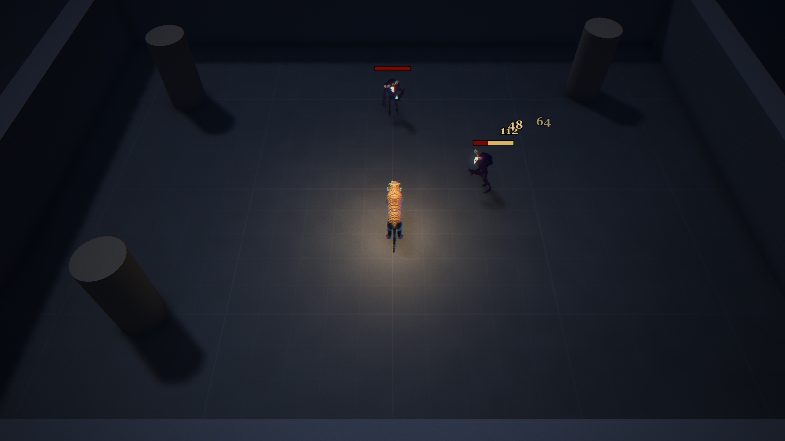
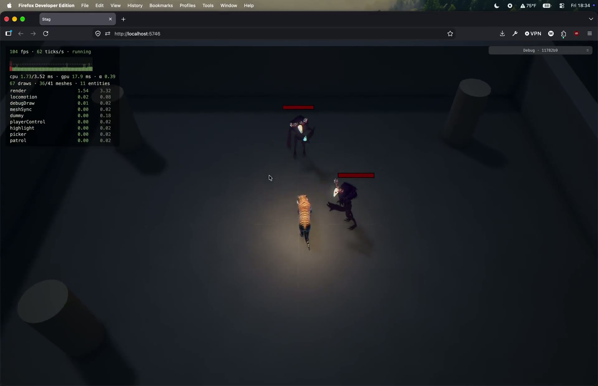
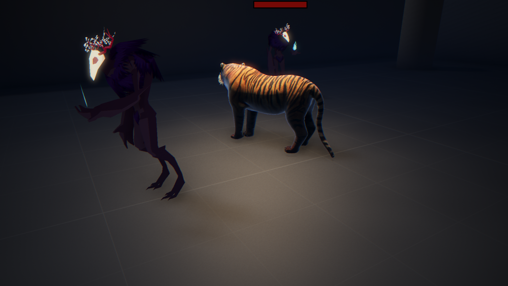
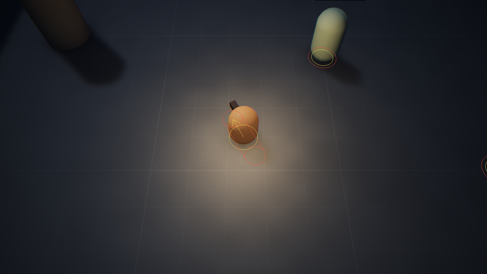

# 2.1 Health, Damage & Test Dummies

> 2026-10-02 · [plan](../../slopdocs/plans/2.1-health-and-dummies.md)

## What we built

A Training yard: an open room with three pillars and two dummies to try abilities on, one standing north of the spawn and one gliding back and forth across the middle. They stand 2.6 m tall, well over the tiger. Both are the Forest Guardian, a stylized spirit guide with a glowing skull mask and a blue spirit flame. Each has health, a health bar whose lost part shows pale for a moment and then drains, and a damage number that pops for every hit. They never die: three seconds after the last hit they're back to full. Under them sits the receiving end of combat: hit shapes (circle, cone, line) that test against a body's hurtbox, and `applyDamage`. Nothing deals damage yet. The ability framework in 2.2 will be the first thing that does.

## Key decisions

- **Targets before abilities.** We started 2.1 as the ability framework, then swapped Phase 2 around so abilities would have something to hit from day one. Enemy AI stays in Phase 3: enemy attacks should be cast through the same ability framework, so building enemies first would have meant writing their attacks twice.
- **No damage source in this step.** We considered a debug hit tool and a placeholder swipe, and dropped both: damage gets tested in play once abilities exist. Here it's covered by unit tests, and the bars and refill by editing a dummy's health in the entity pane.
- **Touching the body counts.** Hits test against the hurtbox, a circle or a pill like the tiger's long body, not the center, the way League does it. They're pure area checks: pillars don't block them. Abilities that need cover will cut their own shapes short with the collision casts.
- **Dummies, not enemies.** No AI, no death. A dummy notices any drop in its health, whether a hit or a pane edit, and refills once it's left alone, like League's practice dummy.
- **You can't ghost through enemies, but you never think about them.** Every body (the player, the dummies, later enemies) blocks every other, both ways. An enemy's collision circle is a tiny 0.15 m, far smaller than its 0.6 m hurtbox. Like League's units, bodies aren't in the pathfinding: right-click paths go straight through, and you slide round them.
- **Themed models over training dummies.** We looked at medieval and wooden training dummies first, then widened the search to anything that fits the theme. The Forest Guardian won on vibe, and its painterly, unlit art style is a candidate for later. It has no rig, so instead of walking it hovers and leans into its glide, which suits a spirit.

## Surprises & problems

- **Entity ids aren't stable.** The plan had one shared list of combat events naming their targets. miniplex only hands out ids when something asks (the debug pane does), so a stored id would differ between the browser and a headless replay. Each target now keeps the hits it took this tick on its own `health`, cleared at the start of the next tick.
- **The patrol overshot its ends** by a few millimetres with gentle braking. It now lands on an end and stops dead, like the player's right-click moves.
- **The first download was a 2018 `.3ds`** without materials. Sketchfab's auto-converted glb kept the look, but every material was unlit and it brought a grassy display base and 48 invisible leftover meshes. The build script strips those: 0.24 MB in the end.
- **The damage numbers started under the health bar** and crossed it on their way up. They now start just above it.

## Media

A playtest in the Training yard after the follow-ups: the tiger among the 2.6 m Guardians, now solid.

The Guardian up close: the patrolling one gliding past the tiger, the static one behind.

Hitboxes and the `footprint` debug category: the player's movement circle and body pill, and the static dummy's collision circle (yellow, what blocks) inside its hurtbox (red, what gets hit). This shot is from before the dummies grew and their collision circle shrank to 0.15 m.

