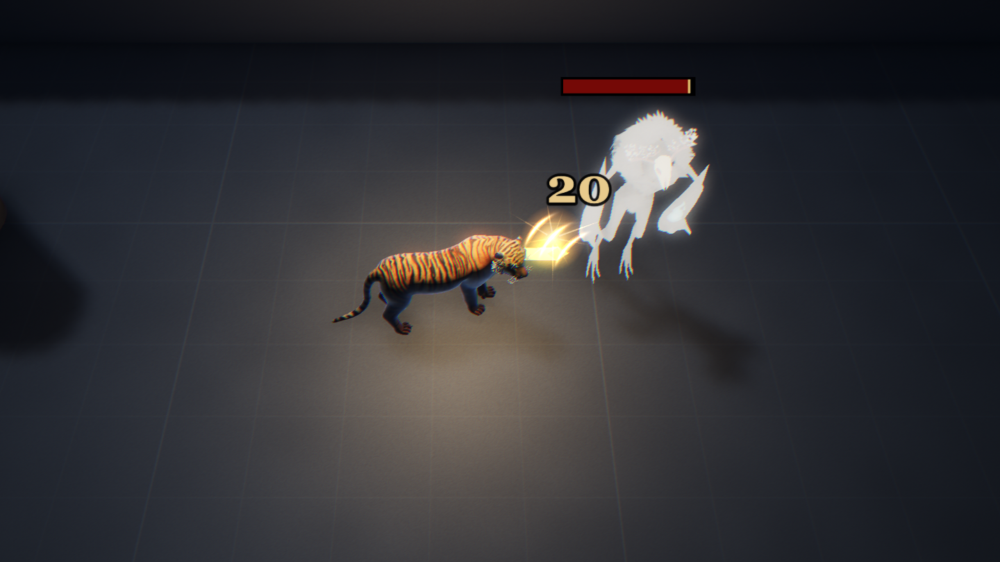
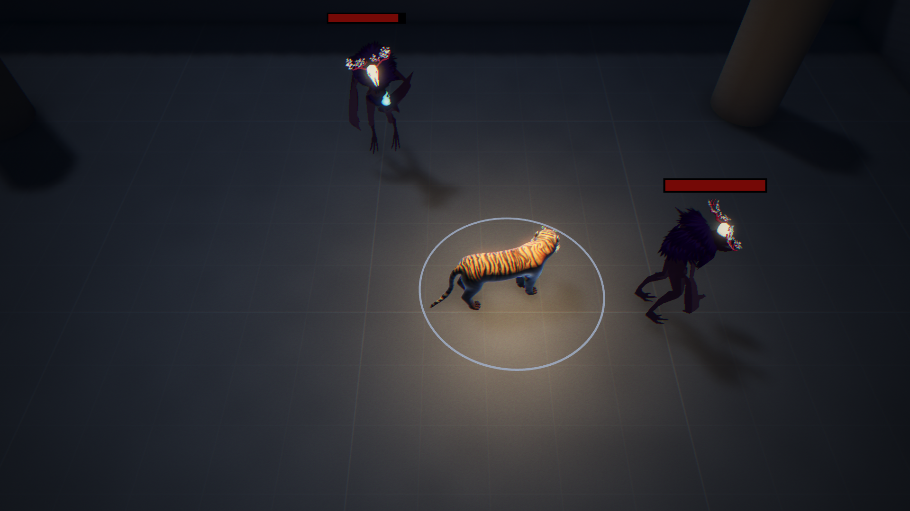
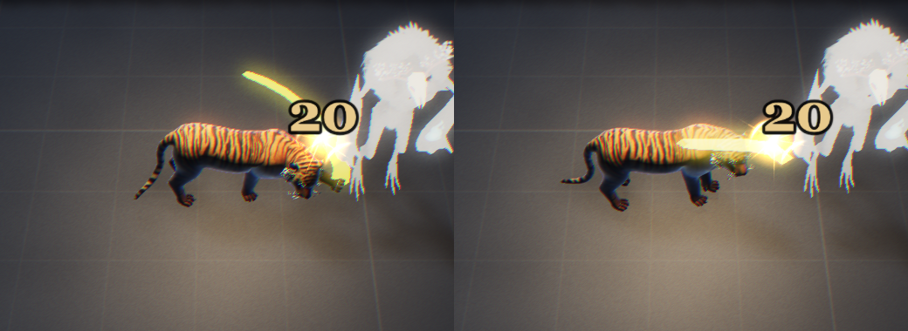
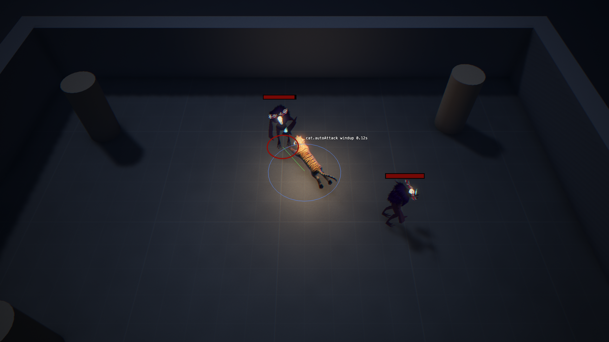

# 2.2 Ability Framework + Cat Auto Attack

> 2026-10-02 · [plan](../../slopdocs/plans/2.2-ability-framework.md)

## What we built

The first thing in the game that deals damage. The cat's **auto attack** hits one enemy, the one you right-click (or the nearest one with an attack move, `S` then left click). It attacks about once every 1.4 s and slams for 20. Under it is the whole ability framework: five slots (the auto attack, three basics, the ultimate), cooldowns, a short press buffer, instant/windup/channel casts, target/direction/point/self aiming, and effects as data (damage to the target or in an area). Only the auto attack is in the game. The rest is covered by tests, including an enemy-side caster, since enemies will attack through the same machinery in 3.1. On screen, the enemy under the cursor glows and the cursor turns into claw marks. The cat coils, then stretches into a cross-body swipe with a random paw, modelled on Nidalee's cougar, and the paw meets the target as the damage lands, with an impact burst, scratches, a flash and a recoil. A move order during the short windup cancels the attack, like League. The tiger and its procedural swipe are placeholders: the art pass makes every model and animation custom.

## Key decisions

- **It's an auto attack, and always single target.** Not a "swipe": that name might belong to an ability later. The auto attack sits outside the 3 + 1 loadout, but it's cast through the same framework.
- **You attack what you click, in both schemes.** WASD keeps a sticky target: click an enemy and the cat attacks it whenever it's ready and in range, until you move or click elsewhere. Holding the button while moving attacks whatever is under the cursor, so A + click runs left, strikes in passing and keeps running. In MOBA, a right-click on an enemy is League's attack order: chase into range and keep attacking. WASD never walks you anywhere.
- **The view picks, the sim decides.** The enemy under the cursor is picked on screen, so a 2.6 m Guardian counts anywhere on its body. That pick goes into the recorded input as a `uid`, so replays stay deterministic. Entities got stable uids for this, because miniplex's own ids are handed out lazily.
- **A short root, and a started attack always lands.** The cat stops and turns for the ~0.26 s windup only. Once the windup starts, the hit lands even if the target walks off, like a League melee attack.
- **Attack move, our way round.** In MOBA, `S` arms an attack move and `A` stops: League's keys, swapped. While it's armed, a pale ring shows the auto attack's reach; the left click that places it hides it. A left click goes for the enemy nearest the click, or walks there and attacks the first enemy that comes near.
- **Right-click only.** Settling the attack cancel showed that WASD's hold-to-attack-while-moving and League's cancel-on-move can't share a rule. We dropped WASD for players: right-click is the game's scheme now, and the WASD code waits in the debug pane in case it comes back.
- **A swipe you can feel.** The model's own attack is a two-paw slam that barely shows from above. It became a procedural hook: the paw cocks out to the side, then sweeps across in front of the cat with a lunge and a shoulder whip, and meets the target on the very tick the damage lands.
- **League as the reference.** We put a recording of Nidalee's auto attack next to ours and compared them frame by frame. Most of League's "life" is at the point of contact: a starburst and claw slashes where the paw lands, the number punching in right there, the target reacting. So that's what we built, plus a rear-up and pounce, a glowing paw trail, and a random paw each attack (random from a hash of the attack count, so replays still match).
- **Slow base numbers.** 0.7 attacks per second, so augments and upgrades have somewhere to go. The windup is a share of the attack period, so attack speed shortens it too.

## Surprises & problems

- **Hovering an enemy froze the game.** Babylon's mesh outline makes an invalid WebGPU pipeline inside our SSAO prepass, so every frame failed while an outline was on. The highlight is now a glow from our own WGSL material plugin, and each dummy gets its own copies of the Guardian's materials so only the hovered one lights up.
- **An attack move that sometimes did nothing.** You sent a replay of it, and tracing it input by input showed the cause: `S` pressed while the right button was still down from steering. That held click counted as a new move order and dropped the attack move a tick later. Only a new right-click drops it now.
- **A hind-leg IK that broke the first attack.** To stop the hind feet sliding with the lunge, they were planted and then hopped forward with a small two-bone IK. It mangled the legs on the first attack (most likely because each foot's spot was recorded mid-stride), so it was reverted.
- **The first attack animation didn't land.** The model's clip is almost four seconds of paw slam and roar, and played over the windup it looked like a small nudge forward with the damage arriving after it. The procedural hook replaced it, tuned from frame-by-frame side and top-down shots. A forearm curl in the wrong direction straightened the leg instead of folding it, and too much lift threw the paw over the shoulder.
- **One new entity changed every replay checksum.** The uid counter is an entity, and checksums hash entities by their index. Before rewriting the fixtures, we checked that every recorded run still moved identically.

## Media

An attack move armed: the pale ring is the auto attack's reach until the left click places it. Placed, it pops a red marker with a little chevron pointing at the enemy it picked.

The hit as it lands, two attacks: a right-paw hook arcing over the head (left), and a left-paw one across the shoulders (right). The trail, the impact burst and scratches, the dummy's flash and recoil, and the number punched in at the contact.

The `abilities` debug category mid-windup: the auto attack's reach round the cat (blue), the line to the target (green: in range), and the cast's phase.

